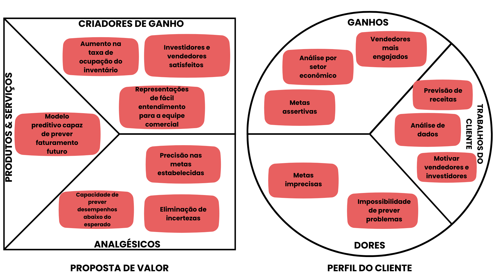
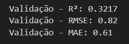
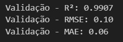
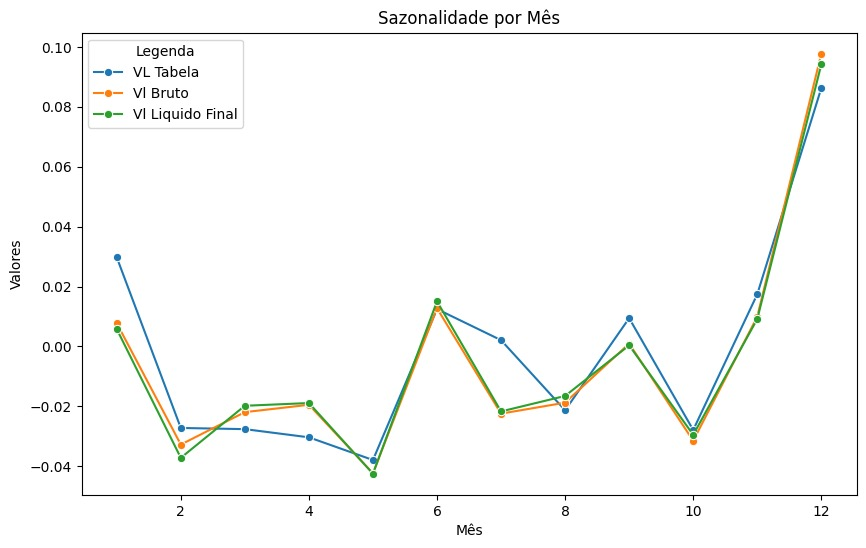
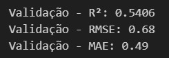

# Documentação Modelo Preditivo (DMP) - Inteli

## Nome da Solução

### Predict Codes

#### Cecília Lima Coelho, Daniel Parente Pessoa Dias, Igor Paço Sguissardi de Oliveira, João Pedro Ferreira Carbone, Lucca Henrique Pereira, Milena Aparecida Vieira Castro, Ricardo de Toledo Planas

## Sumário

[1. Introdução](#c1)

[2. Objetivos e Justificativa](#c2)

[2.1 Objetivos](#c21)

[2.2 Proposta de Solução](#c22)

[2.3 Justificativa](#c23)

[3. Metodologia](#c3)

[4. Desenvolvimento e Resultados](#c4)

[4.1 Compreensão do Problema](#c41)

[4.1.1 Contexto da Indústria](#c411)

[4.1.2 Análise SWOT](#c412)

[4.1.3 Planejamento Geral da Solução](#c413)

[4.1.4 Value Proposition Canvas](#c414)

[4.1.5 Matriz de Riscos](#c415)

[4.1.6 Personas](#c416)

[4.1.7 Jornadas do Usuário](#c417)

[4.1.8 Política de Privacidade](#c418)

[4.2 Compreensão dos Dados](#c42)

[4.2.1 Exploração de Dados](#c421)

[4.2.2 Pré-Processamento dos Dados](#c422)

[4.2.3 Hipóteses](#c423)

[4.3 Preparação dos Dados e Modelagem](#c43)

[4.4 Comparação de Modelos](#c44)

[4.5 Avaliação](#c45)

[5. Conclusões e Recomendações](#c5)

[6. Referências](#c6)

[Anexos](#attachments)

## <a id="c1"></a>1. Introdução

&nbsp;&nbsp;&nbsp;&nbsp;A Rede Gazeta do Espírito Santo é o maior grupo de comunicação do estado, dominando o mercado e sendo reconhecida pela credibilidade, modernidade e ética. A empresa abrange diversas plataformas de comunicação, incluindo um site de notícias, oito rádios, quatro emissoras de TV aberta e dois portais de notícias locais.

&nbsp;&nbsp;&nbsp;&nbsp;Atualmente, as metas de venda de publicidade da empresa são definidas com base no desempenho do ano anterior, desconsiderando fatores críticos como sazonalidade, evolução dos setores dos clientes e eventos extraordinários. Essa abordagem pouco assertiva resulta em previsões incorretas, prejudicando o planejamento da empresa.

## <a id="c2"></a>2. Objetivos e Justificativa

### <a id="c21"></a>2.1 Objetivos

&nbsp;&nbsp;&nbsp;&nbsp;A Rede Gazeta, como parceira de negócios, precisa de uma abordagem mais eficaz para prever o faturamento da empresa, considerando o período estimado, a localização e o segmento de mercado. Isso garantirá que as metas projetadas sejam mais alinhadas com a realidade da companhia e com as condições do mercado em geral.

### <a id="c22"></a>2.2 Proposta de Solução

&nbsp;&nbsp;&nbsp;&nbsp;Para realizar a previsão do faturamento com base em um banco de dados, a utilização de um modelo preditivo é a opção mais viável. Nesse contexto, um modelo de regressão se destaca como a escolha mais eficiente, pois permite avaliar os valores presentes na base de dados e gerar novas estimativas, levando em consideração suas respectivas variâncias.

### <a id="c23"></a>2.3 Justificativa

&nbsp;&nbsp;&nbsp;&nbsp;O projeto tem como objetivo prever faturamento, modelos preditivos, portanto, oferecem uma análise robusta e precisa, pois conseguem lidar com a diversidade e o volume dos dados, além de incorporar múltiplas variáveis, como histórico de vendas, sazonalidade, localização geográfica, e comportamento do mercado.

&nbsp;&nbsp;&nbsp;&nbsp;A capacidade do modelo preditivo de processar e aprender com grandes quantidades de dados permite gerar previsões mais confiáveis, que auxiliam na tomada de decisões estratégicas. Isso resulta em metas financeiras mais realistas, otimização de recursos, e maior competitividade no mercado, garantindo que a empresa possa ajustar suas estratégias de forma proativa, de acordo com as tendências e mudanças no cenário econômico.

## <a id="c3"></a>3. Metodologia

&nbsp;&nbsp;&nbsp;&nbsp;O CRISP-DM (Processo Padrão Intersetorial para Mineração de Dados) é uma metodologia amplamente reconhecida que orienta projetos de mineração de dados por meio de um processo estruturado, funcionando de maneira cíclica. Desenvolvido no final dos anos 1990 por um consórcio que incluía diferentes empresas, sendo elas: Daimler-Benz, SPSS e NCR, se tornou o padrão para mineração de dados em várias indústrias devido à sua flexibilidade, natureza independente de ferramentas e abordagem iterativa.

&nbsp;&nbsp;&nbsp;&nbsp;As etapas do Crisp-DM consistem em um esquema cíclico com o objetivo de minimizar erros e facilitar a interação com o cliente e com os dados oferecidos pelo mesmo. 

&nbsp;&nbsp;&nbsp;&nbsp; **Compreensão do Negócio:** Esta fase inicial é de grande importância para definir os objetivos do projeto, envolvendo uma perspectiva da compreensão do problema, estabelecendo metas e critérios de sucesso.

&nbsp;&nbsp;&nbsp;&nbsp; **Compreensão de dados:** Com os objetivos de negócios claros, o próximo passo é coletar, descrever e explorar os dados disponíveis. Esta fase envolve a coleta de dados, a avaliação da qualidade dos dados e a descoberta de insights iniciais que podem influenciar as próximas etapas do processo.

&nbsp;&nbsp;&nbsp;&nbsp; **Preparação dos dados:**  Esta fase trata da transformação dos dados brutos em um formato adequado para modelagem. Inclui a limpeza dos dados, o tratamento de valores ausentes, a normalização dos dados e a criação de novas características ou variáveis. Uma preparação de dados eficaz é de extrema importância para construir modelos robustos.

&nbsp;&nbsp;&nbsp;&nbsp; **Modelagem:**  Durante esta etapa, diferentes técnicas de modelagem são selecionadas e aplicadas aos dados preparados. A escolha do modelo depende dos dados e do problema a ser resolvido. Esta fase também inclui o ajuste dos parâmetros do modelo e a avaliação de diferentes modelos para identificar o melhor.

&nbsp;&nbsp;&nbsp;&nbsp; **Avaliação:** Antes da implantação, é importante avaliar o modelo para garantir que ele atenda aos objetivos de negócios. Esta fase envolve a avaliação da precisão e robustez do modelo e a determinação se ele satisfaz os critérios de sucesso estabelecidos na fase de compreensão do negócio.

&nbsp;&nbsp;&nbsp;&nbsp; **Implantação:** A etapa final envolve a implantação do modelo no ambiente real, onde ele pode fornecer insights para o projeto. Isso pode incluir a integração do modelo nos processos de negócios, a configuração de sistemas de monitoramento e a garantia de que os resultados sejam comunicados de forma eficaz às partes interessadas.

&nbsp;&nbsp;&nbsp;&nbsp;O CRISP-DM é iterativo, o que significa que frequentemente é necessário revisitar etapas anteriores para refinar o modelo à medida que surgem novos insights ou que as necessidades de negócios evoluem. Essa flexibilidade é uma das razões pelas quais o CRISP-DM permanece relevante, apesar dos rápidos avanços em ciência de dados e aprendizado de máquina.

## <a id="c4"></a>4. Desenvolvimento e Resultados

### <a id="c41"></a>4.1. Compreensão do Problema

#### <a id="c411"></a>4.1.1. Contexto da indústria

&nbsp;&nbsp;&nbsp;&nbsp;A Rede Gazeta, afiliada da Rede Globo no Espírito Santo, exerce grande influência no mercado de comunicação do estado, sendo considerada o maior grupo de comunicação da região. Conhecida por sua presença de longa data e atuação tradicional e próxima ao público, a Rede Gazeta está presente em uma diversidade de veículos de comunicação, sendo o principal deles a indústria televisiva.

&nbsp;&nbsp;&nbsp;&nbsp;Ao analisar o mercado de comunicação do Espírito Santo, com foco na indústria televisiva, percebe-se que a influência e a atuação das redes de comunicação do estado refletem o que ocorre no país, uma vez que as principais emissoras de televisão estão inseridas na região por meio das afiliadas. Baseado no monitoramento de audiência realizado no mês de janeiro de 2023 pela Kantar Ibope Media, empresa de medição e análise de audiência, percebe-se que os principais players do mercado, em ordem decrescente de audiência, são: Rede Globo, com a Rede Gazeta como filial no Espírito Santo; Record, com a TV Vitória; SBT, com a TV Tribuna; e Rede Bandeirantes, com a TV Capixaba. Essas emissoras exibem conteúdos das redes a que pertencem e possuem horários para a exibição de programas próprios e jornais regionais. Entre elas, a Rede Gazeta se destaca e possui grande predominância.

&nbsp;&nbsp;&nbsp;&nbsp;Considerando que as emissoras oferecem exibição gratuita ao público, é necessário gerar fontes de faturamento. Dessa forma, elas apresentam modelos de negócios semelhantes, baseados em uma fonte diversificada de monetização de conteúdo e publicidade. O espaço publicitário, prática padrão de todas as empresas citadas, é a principal fonte de receita, com a exibição de anúncios publicitários durante os intervalos da programação televisiva. Além disso, o merchandising, no qual produtos e marcas são inseridos diretamente nos programas, é responsável por uma receita significativa. Pode-se citar também o aluguel de horários, no qual blocos de programação são vendidos para programas de televendas ou igrejas, sendo essa uma forma fixa de obtenção de renda, embora não seja muito utilizada por emissoras como o SBT e a Rede Globo. O patrocínio de eventos, amplamente aplicado pela Rede Globo, baseia-se na exibição de grandes eventos ao vivo, como shows, esportes ou festivais, como o Carnaval e campeonatos esportivos, e na venda de patrocínios específicos para esses eventos. Uma prática mais recente é a busca pela inserção na exibição de conteúdos online. As emissoras têm investido na exibição de canais por meio de sites ou na criação de plataformas de streaming, onde a monetização pode ocorrer via assinaturas ou por meio de anúncios nas plataformas digitais.

&nbsp;&nbsp;&nbsp;&nbsp;Diante das mudanças geradas pelo avanço tecnológico, o mercado televisivo apresenta tendências baseadas na mudança de hábitos de consumo de conteúdo. Tendências como a integração de publicidade cross-mídia, onde campanhas são sincronizadas em múltiplas plataformas, e a intensificação da incorporação de marcas diretamente no conteúdo estão em alta. Além disso, o crescimento da inserção no mundo online reflete a busca das emissoras por formas inovadoras de engajar o público e gerar novas fontes de receita, adaptando-se à era digital.

&nbsp;&nbsp;&nbsp;&nbsp;Sendo assim, com base na análise do mercado em que a Rede Gazeta está inserida, percebe-se que as formas de faturamento e a atuação do grupo na região são diversificadas, com uma influência predominante e uma presença marcante no estado. No entanto, a empresa ainda aplica métodos com pouca análise técnica e quantitativa para determinar metas de faturamento. Tal ação pode resultar em desafios na definição de metas realistas, que sejam ao mesmo tempo motivadoras para a equipe de vendas e alcançáveis em termos de receita. Portanto, a parceria com o Inteli para o desenvolvimento de um modelo preditivo pode auxiliar na previsão mais assertiva das receitas, oferecendo uma base quantitativa para a definição de metas. Assim, possibilitando justificar com maior precisão eventuais desvios nas metas e otimizar o desempenho financeiro do grupo, garantindo tanto a satisfação da equipe quanto a lucratividade da empresa.

&nbsp;&nbsp;&nbsp;&nbsp;A análise das cinco forças de Porter é fundamental para a Rede Gazeta e outras empresas, pois fornece uma boa análise da indústria em que a empresa está inserida. Ela permite identificar ameaças e oportunidades, desenvolver estratégias competitivas e se manter atento às mudanças do mercado. Para a Rede Gazeta, é muito importante entender sua posição no mercado de mídia e tomar decisões estratégicas informadas para garantir sua competitividade e relevância a longo prazo.

<div align="center">
<sub><a id="f1"></a>Figura 01 - 5 Forças de Porter</sub>

<sup>Fonte: Material produzido pelos autores (2024)</sup>
</div>

&nbsp;&nbsp;&nbsp;&nbsp;**1. Poder de barganha dos clientes da Rede Gazeta:** O poder de barganha dos clientes da Rede Gazeta é significativo, pois os consumidores dispõem de uma ampla gama de alternativas para acessar mídia e entretenimento, como redes sociais, podcasts, serviços de streaming, além das opções oferecidas por rádios e televisões concorrentes. Essas alternativas, muitas vezes gratuitas, atendem às necessidades do público-alvo de maneiras mais convenientes ou personalizadas.

&nbsp;&nbsp;&nbsp;&nbsp;Essa dinâmica de mercado se traduz em comportamentos concretos, como a migração dos espectadores tradicionais para plataformas digitais, onde eles podem acessar conteúdos sob demanda e sem custos adicionais. Esse movimento pressiona empresas tradicionais como a Rede Gazeta a adaptarem suas estratégias de conteúdo e distribuição. Além disso, a busca por opções mais acessíveis ou gratuitas intensifica a necessidade de oferecer produtos com preços competitivos ou gratuitos, sob o risco de perder audiência para competidores digitais.

&nbsp;&nbsp;&nbsp;&nbsp;Apesar dessas pressões, a Rede Gazeta conta com vantagens competitivas importantes, como a credibilidade e o reconhecimento conquistados ao longo de décadas, especialmente no que diz respeito à cobertura do cotidiano e das principais notícias do Espírito Santo. Essa confiança estabelecida ajuda a fidelizar uma parcela significativa de sua audiência, que ainda prefere consumir conteúdo de uma fonte confiável. Além disso, o grande alcance da Rede Gazeta em comparação com concorrentes locais, tanto em termos de penetração quanto de impacto, facilita a proximidade com o consumidor, mitigando, assim, parcialmente o poder de barganha dos clientes.

&nbsp;&nbsp;&nbsp;&nbsp;**2. Poder de barganha dos fornecedores:** O poder de negociação dos fornecedores é considerado alto na Rede Gazeta, principalmente devido à sua afiliação com a TV Globo, que é uma das maiores e mais influentes emissoras do Brasil. Como a principal fonte de receita da Rede Gazeta vem da TV Gazeta, que opera como afiliada da Globo no Espírito Santo, a Globo possui um grande poder de negociação, podendo impor termos contratuais que muitas vezes favorecem seus próprios interesses. Esse poder se manifesta, por exemplo, na divisão de receita publicitária, onde a Globo pode definir condições que maximizam seus ganhos, potencialmente em detrimento da Rede Gazeta. Além da influência direta do Grupo Globo, outros fornecedores também exercem um poder significativo. Por exemplo, o licenciamento de músicas e transmissões esportivas, essenciais para a programação de TV, pode ser difícil de negociar devido ao controle que grandes empresas detêm sobre esses conteúdos. Essas empresas podem impor preços elevados ou condições rígidas para o uso de suas propriedades intelectuais. Da mesma forma, grandes anunciantes, que procuram espaços publicitários para divulgar seus serviços, têm a capacidade de negociar termos favoráveis devido à sua importância como fonte de receita.

&nbsp;&nbsp;&nbsp;&nbsp;**3. Rivalidade entre concorrentes:** A rivalidade entre os concorrentes no setor de comunicação é alta, com diversas opções disponíveis para o público, como canais de televisão abertos, jornais digitais e rádios. No entanto, no Espírito Santo, a TV Gazeta se destaca como líder absoluta em audiência, com 2,7 milhões de capixabas – cerca de 71% da população do estado – assistindo ao programa Gazeta Meio Dia no horário de almoço, de acordo com dados da Kantar/Ibope Media. Essa posição dominante na televisão local coloca a TV Gazeta em vantagem sobre muitos concorrentes tradicionais. A análise da rivalidade no setor deve considerar a crescente influência das plataformas digitais emergentes e dos serviços de streaming, que têm capturado a atenção de audiências, especialmente as mais jovens. Embora a Rede Gazeta mantenha uma forte presença e a confiança do público, enfrenta desafios significativos com a entrada de novos competidores no mercado digital. Apesar de sua liderança na televisão, concorrentes como portais de notícias digitais e rádios locais estão ganhando espaço com suas ofertas de conteúdo sob demanda e em tempo real, adaptando-se rapidamente às mudanças nos hábitos de consumo de mídia.

&nbsp;&nbsp;&nbsp;&nbsp;**4. Ameaça de produtos substitutos:** A ameaça de produtos substitutos é considerada muito alta, uma vez que está sendo observada uma mudança nos hábitos de consumo da população, com indivíduos optando por acessar o conteúdo de forma imediata, como em serviços de streaming, em vez de esperar a transmissão de um programa que gostam em um canal de televisão. Um exemplo é a TV Globo, que vem sofrendo quedas de audiência, como no programa Fantástico, um dos programas de maior audiência da emissora, que registrou o menor número de telespectadores em quatro anos, segundo a Kantar Ibope, no dia 07/07/2024. Essa tendência também se reflete no mercado local, onde a penetração dos serviços de *streaming* tem aumentado significativamente. De acordo com dados da Kantar Ibope Media, cerca de 74% das residências urbanas no Brasil já possuem acesso a pelo menos uma plataforma de streaming, o que impacta diretamente a audiência da televisão tradicional. A migração para esses serviços e o consumo crescente de podcasts e vídeos sob demanda reforçam a necessidade de inovação por parte da Rede Gazeta.

&nbsp;&nbsp;&nbsp;&nbsp;**5. Ameaça de novos entrantes:** A ameaça de novos entrantes é considerada de nível moderado. A Rede Gazeta é uma empresa consolidada em diferentes segmentos de mídia no Espírito Santo, sendo uma marca reconhecida e com a confiança do público capixaba. Por isso, o cenário para novos concorrentes acaba sendo desafiador, especialmente em relação às mídias tradicionais, já que é necessário muita infraestrutura e investimento para competir com a TV Gazeta e os canais de rádio da Gazeta. Uma opção mais viável, que não requer investimentos tão significativos, é o segmento digital; contudo, a Gazeta também se destaca nesse campo, com veículos que contam com grande confiança do público, como o perfil do Instagram “A Gazeta ES”, que possui mais de 900 mil seguidores, o que reduz a ameaça de novos entrantes. No entanto, novos competidores podem surgir em nichos específicos, como mídias digitais independentes, podcasts ou veículos de comunicação hiperlocalizados, que exigem menor investimento inicial e podem se diferenciar por meio de conteúdos especializados e plataformas inovadoras. A Rede Gazeta pode se preparar para enfrentar esses potenciais concorrentes fortalecendo sua presença digital, investindo em novos formatos de conteúdo, como podcasts e vídeos on-demand, e criando parcerias com influenciadores digitais locais. Além disso, a Gazeta pode explorar estratégias para atrair e reter uma audiência mais jovem e engajada, que costuma consumir conteúdos em plataformas digitais e redes sociais.

&nbsp;&nbsp;&nbsp;&nbsp;Portanto, é possível concluir que a Rede Gazeta está bem posicionada na indústria de comunicação, consolidada como o maior canal de comunicação do Espírito Santo, com uma forte presença tanto na mídia tradicional quanto na digital. Nesse contexto, no entanto, é essencial que a empresa fique atenta às mudanças nos hábitos de consumo da população e invista em inovação para que as plataformas digitais não impactem negativamente a Rede Gazeta.

#### <a id="c412"></a>4.1.2. Análise SWOT

&nbsp;&nbsp;&nbsp;&nbsp;A Rede Gazeta do Espírito Santo é uma das principais e mais tradicionais empresas de comunicação da região, com uma presença significativa em diversas plataformas de mídia, incluindo televisão, rádio, jornal impresso e digital. Com décadas de história, a Rede Gazeta se consolidou como uma fonte confiável de notícias e entretenimento para os capixabas. Porém, como qualquer empresa do setor de comunicação, enfrenta desafios contínuos devido às rápidas mudanças tecnológicas e ao comportamento do consumidor, diversificando cada vez mais o público consumidor.

<div align="center">
<sub>Figura 02 - Análise SWOT</sub><br>
<br>
<sup>Fonte: Material produzido pelos autores (2024)</sup>
</div>

&nbsp;&nbsp;&nbsp;&nbsp;A análise SWOT da Rede Gazeta do Espírito Santo revela uma organização robusta, com uma forte tradição e reconhecimento no mercado local, forças as quais se traduzem em vantagens competitivas para a empresa, como a fidelidade do público-alvo ou mesmo a eficácia das campanhas publicitárias impulsionadas pela Rede. Em relação às fraquezas, é possível notar que a empresa enfrenta desafios significativos devido à transformação digital e à competição intensa de novas plataformas de mídia, o que impacta cotidianamente as operações promovidas pela Rede Gazeta, visto o grande alcance e acessibilidade que o meio digital proporciona para plataformas midiáticas mais adaptadas a esse contexto. Diante disso, as oportunidades de crescimento se mostram abundantes, especialmente nesse espaço digital, no qual a Rede Gazeta pode expandir seu alcance por meio de segmentos digitais específicos, como plataformas de *streaming* ou de vídeos curtos e interativos, bem como inovar em suas ofertas de conteúdo por meio da implementação de uma cultura *data-driven*. No entanto, para capitalizar essas oportunidades, a empresa precisará se adaptar rapidamente às mudanças tecnológicas e aos novos hábitos de consumo de mídia. Ao focar em parcerias estratégicas, principalmente com plataformas emergentes, personalização de conteúdo e investimento em novas tecnologias, a Rede Gazeta pode não apenas manter sua relevância, mas também prosperar em um mercado cada vez mais competitivo e digitalizado.

#### <a id="c413"></a>4.1.3. Planejamento Geral da Solução

&nbsp;&nbsp;&nbsp;&nbsp;Frente a necessidade de prever e definir metas de venda de publicidade baseadas em análises técnicas e quantitativas, a Rede Gazeta trouxe ao Inteli a proposta do desenvolvimento de um projeto que possibilita atingir essa demanda. Para isso, foram fornecidos pela empresa dados referentes ao período de 2020 a 2024 a respeito das vendas publicitárias realizadas, audiência de cada veículo de comunicação da empresa, ocupação comercial, atingimento das metas definidas nos anos anteriores e dados sobre o mercado em que a empresa está inserida.

&nbsp;&nbsp;&nbsp;&nbsp;Para solucionar a problemática apresentada com base nos dados fornecidos, foi proposta a criação de um modelo preditivo, uma ferramenta que utiliza dados e algoritmos para prever eventos futuros. Com base na análise dos dados de vendas, audiência da empresa e do contexto de mercado, esse modelo é capaz de prever as receitas publicitárias dos próximos 12 meses, auxiliando na tomada de decisões e na definição de metas.

&nbsp;&nbsp;&nbsp;&nbsp;O tipo de tarefa realizada pelo modelo desenvolvido é a de regressão, aplicada quando o objetivo é prever valores contínuos a partir da análise de dados. Essa abordagem foi escolhida devido à necessidade de prever as receitas da empresa, que são valores numéricos contínuos. Assim, através da análise e correlação dos dados disponíveis, o modelo de regressão permite gerar previsões numéricas precisas das receitas, atendendo à demanda de planejamento estratégico e definição de metas.

&nbsp;&nbsp;&nbsp;&nbsp;Sendo assim, o modelo preditivo desenvolvido será aplicado diretamente no processo de planejamento de vendas publicitárias da Rede Gazeta. Ele será usado na gestão de metas e receitas da empresa, permitindo que a equipe de vendas consulte as previsões geradas para definir metas mais precisas. Com base nas análises técnicas fornecidas pelo modelo, a equipe poderá ajustar suas estratégias de vendas ao longo do ano, garantindo que as metas estejam alinhadas com as tendências de mercado e os dados históricos.

&nbsp;&nbsp;&nbsp;&nbsp;A implementação dessa solução traz alguns benefícios para a Rede Gazeta. O principal deles é a capacidade de definir metas de vendas mais assertivas, baseadas em previsões quantitativas e técnicas. Isso resulta em uma tomada de decisão mais informada, permitindo uma alocação mais eficiente de recursos e estratégias de vendas mais eficazes. Além disso, o ajuste contínuo das previsões ao longo do ano, conforme as análises do modelo, contribuirá para otimizar o desempenho comercial, aumentando a eficácia e o retorno sobre as vendas publicitárias.

&nbsp;&nbsp;&nbsp;&nbsp;Por fim, as métricas e critérios de sucesso para o modelo preditivo desenvolvido serão baseados em sua capacidade de fornecer previsões precisas e consistentes das receitas publicitárias. As métricas aplicadas serão a precisão das previsões e a ajuda no aumento do faturamento da empresa. O sucesso do modelo será determinado por previsões que possibilitem determinar metas que estejam próximas do faturamento real, além da sua capacidade de melhorar a eficiência na tomada de decisões. Além disso, a satisfação das partes interessadas será um indicador importante da eficácia do modelo.

#### <a id="c414"></a>4.1.4. Value Proposition Canvas

&nbsp;&nbsp;&nbsp;&nbsp; O Canva de Proposta de Valor é uma ferramenta visual e estratégica utilizada para o desenvolvimento de produtos, soluções e projetos. Essa utilidade tem foco em garantir que uma solução proposta atenda às necessidades e desejos dos clientes. Ela ajuda a mapear e entender os benefícios que a solução proposta devem oferecer para atender as solicitações do cliente e criar ganhos significativos para eles.

<div align="center">
<sub><a name="f1"></a>Figura 03 - Canvas de Proposta de Valor</sub>

<sup>Fonte: Material produzido pelos autores (2024)</sup>
</div>

##### Perfil do Cliente

###### Trabalhos do Cliente:

- **Impossibilidade de prever receitas:** Os gestores precisam prever o rendimento da empresa para estabelecer metas de vendas e tomar decisões estratégicas.
- **Análise de dados:** A empresa precisa garantir que suas metas sejam atraentes para investidores, mas ao mesmo tempo realistas e alcançáveis.
- **Motivar vendedores e investidores:** É crucial definir metas de vendas que sejam desafiadoras, mas alcançáveis, para manter a motivação das equipes.

###### Dores:

- **Incerteza nas Projeções:** As previsões atuais são baseadas apenas na experiência com mercado e tato dos gestores, resultando em metas imprecisas.
- **Metas imprecisas:** Metas baixas desestimulam investidores, enquanto metas altas desmotivam os vendedores, situação que distancia os *stakeholders* da empresa, tornando-os, assim, menos interessados nos produtos ofertados e menos propensos a engajarem iniciativas e projetos propostos pela Rede Gazeta.
- **Falta de Planejamento Eficaz:** A ausência de um modelo preditivo preciso limita a capacidade da empresa de planejar ações proativas, como ajustar preços ou oferecer descontos estratégicos.

###### Ganhos:

- **Metas assertivas:** A empresa tem o objetivo de possuir previsões de receita mais assertivas, que permitam metas realistas e baseadas em conjuntos de dados que possibilitem estabelecer metas mais próximas da realidade.
- **Vendedores mais engajados:** Metas realistas e alcançáveis aumentam a motivação e o desempenho das equipes de vendas, ao contrário de metas imprecisas, que não fornecem segurança a respeito da possibilidade de serem alcançadas. Dessa maneira, os *stakeholders* se tornam mais próximos e fiéis à empresa, de forma a aumentar a garantia de sucesso das iniciativas promovidas por ela.
- **Análise por setor econômico:** Realizar as predições considerando diferentes segmentos, possibilitando considerar o desempenho de setores econômicos que influenciam nos rendimentos da empresa. Será possível visualizar a receita por segmento e identificar quais segmentos estão dando maior lucro e quais estão com desempenho abaixo do esperado, promovendo campanhas para arrecadação de receita.

##### Proposta de Valor

###### Produtos e Serviços:

- **Modelo Preditivo de Receita:** Desenvolvimento e implementação de um modelo preditivo que analisa dados históricos e atuais para calcular o rendimento projetado da empresa nos próximos 12 meses, segmentado por diferentes áreas de atuação.

###### Analgésicos:

- **Eliminação de incertezas:** O modelo preditivo irá reduzir significativamente a possibilidade de erros das projeções atuais, isto é, reduzirá a imprecisão das previsões realizadas, substituindo as estimativas feitas com base em experiência de mercado dos gestores por análises baseadas em um grande conjunto de dados.
- **Precisão nas metas estabelecidas:** Com projeções precisas, a empresa pode definir metas que são desafiadoras, mas alcançáveis, aumentando tanto a confiança dos investidores quanto a motivação dos vendedores.
- **Capacidade de prever resultados negativos:** A empresa pode planejar ações estratégicas, como descontos maiores para os anunciantes, para assegurar o cumprimento das metas de receita.

###### Criadores de Ganho:

- **Aumento da taxa de ocupação do inventário:** O modelo preditivo permite à empresa maximizar sua receita de forma geral ao tomar decisões informadas e oportunas, a exemplo de oferecer descontos maiores para aumentar a ocupação de espaços publicitários.
- **Investidores e vendedores satisfeitos:** Metas baseadas em dados aumentam a credibilidade da empresa com os investidores, atraindo mais investimentos. As metas realistas agradam tanto os investidores quanto a equipe de vendas.
- **Representação de fácil entendimento para a equipe comercial:** Haverá uma plataforma para que a equipe comercial consiga analisar e visualizar facilmente os dados, com gráficos e tabelas.

&nbsp;&nbsp;&nbsp;&nbsp;A partir dessa análise, conclui-se que a solução proposta pretende aumentar a assertividade na previsão de receita da Rede Gazeta, promovendo ganhos, direta ou indiretamente, no que diz respeito à precisão das metas formuladas, aos engajamento e proximidade dos *stakeholders*, bem como à análise de receita por setor econômico realizada pela Rede Gazeta. Ao fornecer uma modelo preditivo que permite estabelecer metas muito próximas da receitas futuras. Assim, a equipe comercial poderá estabelecer metas que agradem os investidores e motivem a equipe de vendas, ao mesmo tempo que ficaram mais preparados para desempenhos abaixo do esperado por setores, promovendo a possibilidade da realização de planos de respostas para assegurar maior faturamento.

#### Matriz de Riscos

#### <a id="c415"></a>4.1.5. Matriz de Riscos

&nbsp;&nbsp;&nbsp;&nbsp;A matriz de riscos é um componente vital do gerenciamento de projetos, pois permite a determinação da probabilidade e do impacto de possíveis problemas, incluindo falhas de comunicação e eventos raros. Direcionar a prioridade das ações essenciais e enfrentar mudanças no conflito do projeto. Isso garante que estamos preparados para lidar com os desafios de forma eficiente e manter o projeto no caminho certo em direção aos seus objetivos.

<div align="center">
<sub>Figura 04 - Matriz de Risco</sub><br>
<br>
<sup>Fonte: Material produzido pelos autores (2024)</sup>
</div

**Ameaças identificadas:**
1. Parceiro com expectativas acima do escopo do projeto: Durante a execução do projeto, é fundamental estar alinhado com as expectativas do cliente e com o que é possível realizar dentro do prazo. Durante as validações, é comum que o parceiro solicite funcionalidades adicionais que não cabem no tempo disponível, o que torna este risco altamente provável. Dependendo de como as expectativas do cliente forem gerenciadas, isso pode se tornar uma ameaça moderada para o grupo.

2. Desvio do escopo: Alinhado ao risco anterior, ao receber muitos pedidos ou implementar funcionalidades não previstas no escopo original, o grupo pode perder o foco. Isso pode ocorrer se a equipe passar a acreditar que o módulo demanda menos trabalho do que realmente exige. Assim, a probabilidade desse risco é alta, e o impacto também é considerado alto, pois a perda do escopo pode comprometer significativamente a entrega final.

3. Indecisão do parceiro quanto às necessidades do projeto: Durante os momentos de validação, o parceiro pode ter dúvidas sobre as reais necessidades a serem atendidas pelo modelo preditivo. Esse risco surgiu no início do projeto, dado que o escopo exigia um fornecimento maior de dados por parte do cliente. Embora já tenham sido feitos os alinhamentos necessários, a probabilidade desse risco é média, mas o impacto é alto, pois a indecisão do parceiro pode atrasar o desenvolvimento e comprometer a entrega do projeto.

4. Membros do grupo impossibilitados de trabalhar por fatores externos: Fatores externos, como doenças ou emergências pessoais, podem impedir que alguns membros do grupo continuem contribuindo regularmente com o projeto. A probabilidade desse risco é baixa, dado que o grupo tem demonstrado engajamento até o momento. Contudo, o impacto pode ser muito alto, pois a ausência prolongada de um membro poderia comprometer o cronograma e a capacidade de entrega.

5. Falta de impacto do projeto na Rede Gazeta: Existe o risco de que o projeto não cause o impacto esperado na Rede Gazeta, seja pela inadequação do modelo preditivo às necessidades da empresa, seja pela falta de dados ou entendimento profundo do problema. A probabilidade desse risco é média, dada a complexidade do modelo preditivo e a dependência de dados externos. O impacto é muito alto, pois a falta de impacto na empresa afeta o valor percebido do projeto pelo cliente, podendo levar à insatisfação.

6. Impacto negativo do projeto no faturamento da empresa: Um cenário crítico seria o projeto impactar negativamente as finanças da Rede Gazeta, caso o modelo preditivo falhe em fornecer previsões precisas ou crie interpretações errôneas dos dados financeiros. Embora esse risco tenha uma probabilidade baixa, seu impacto seria muito alto, pois qualquer influência negativa no faturamento da empresa geraria consequências graves para o cliente.

7. Falta de comprometimento dos membros do grupo: A falta de comprometimento dos membros do grupo é um risco presente em qualquer projeto em equipe. Se um ou mais membros não estiverem engajados, o andamento do projeto pode ser atrasado e a qualidade da entrega comprometida. A probabilidade desse risco é baixa, visto que o grupo tem mostrado comprometimento até agora. No entanto, o impacto seria alto, pois poderia afetar os prazos e a qualidade final do projeto.

8. Falta de entrosamento entre os membros do grupo: Embora a falta de entrosamento entre os membros não esteja diretamente relacionada às entregas, ela pode afetar o ambiente de trabalho, a comunicação e o fluxo das atividades do grupo. A probabilidade desse risco é baixa, mas o impacto seria moderado, já que poderia prejudicar o andamento do projeto, a divisão de tarefas e a colaboração.

**Planos de Ação para os Riscos Identificados**

1. Expectativas acima do escopo do projeto: Em caso de divergência de expectativas, deve-se dialogar com o cliente para estabelecer metas claras e relembrar as limitações do projeto e do prazo. Durante as validações, é importante reforçar continuamente o escopo acordado.

2. Desvio do escopo: Definir metas desde o início do projeto com o auxílio dos professores e orientadores, consultando o TAPI e o escopo estabelecido pelo grupo. Caso haja desvios, o grupo deve se reunir para alinhar as entregas viáveis e ajustar o escopo.

3. Indecisão do parceiro: Realizar alinhamentos constantes com o parceiro para definir claramente as necessidades do projeto, respeitando os limites de aprendizado e prazos.

4. Impossibilidade de trabalho por fatores externos: Redistribuir tarefas e, se necessário, ajustar prazos e comunicar a equipe e o parceiro rapidamente para solicitar extensão de prazo, caso seja necessário.

5. Falta de impacto na Rede Gazeta: Revisar o escopo e as metas com base no feedback do parceiro e ajustar o projeto para garantir que ele atenda às necessidades específicas da empresa.

6. Impacto negativo no faturamento: Interromper o uso do modelo imediatamente e realizar uma análise detalhada para identificar e corrigir as falhas.

7. Falta de comprometimento: Se for identificada a falta de comprometimento, uma reunião será agendada com o grupo, e o orientador Marcelo será informado para ajudar a mediar a conversa.

8. Falta de entrosamento: Criar um ambiente de respeito e colaboração, utilizando momentos de sprint retrospective para melhorar a comunicação e a forma de trabalhar.

&nbsp;&nbsp;&nbsp;&nbsp;A análise da matriz de riscos enfatiza a importância de uma gestão de riscos ágil e bem-informada, que é crucial para o desenvolvimento da nossa plataforma. Essa ferramenta guia a criação de protocolos de mitigação e recuperação, sublinhando a necessidade de planos de contingência que possam lidar tanto com pequenos contratempos quanto com eventos de grande impacto. Isso garante a continuidade do projeto e fortalece a confiança dos stakeholders na nossa capacidade de gerenciar as incertezas de forma eficaz.

#### <a id="c416"></a>4.1.6. Personas

&nbsp;&nbsp;&nbsp;&nbsp;Uma persona é uma representação semi-fictícia de um usuário ou cliente ideal, criada com base em dados reais e pesquisas sobre comportamentos, motivações e necessidades de um público-alvo específico. Ela serve como uma ferramenta essencial no desenvolvimento de estratégias de _marketing_, _design_ de produtos e comunicação, permitindo que empresas compreendam melhor as expectativas e os desafios enfrentados por seus clientes. Ao definir uma persona, as organizações podem criar conteúdos, produtos e serviços mais alinhados com os desejos e necessidades reais de seus usuários, tornando suas abordagens mais eficazes e direcionadas.

&nbsp;&nbsp;&nbsp;&nbsp;Existem três tipos principais de personas: proto-personas, personas qualitativas e personas estatísticas. As personas que serão introduzidas são proto-personas, construídas com base em suposições e percepções dos membros da equipe sobre os usuários, sem dados concretos. As personas qualitativas são fundamentadas em entrevistas e observações diretas dos usuários, enquanto as personas estatísticas se baseiam em grandes volumes de dados quantitativos. Embora a proto-persona seja um ponto de partida inicial para discussões e desenvolvimento de estratégias, ela tem o potencial de se tornar uma persona qualitativa ou estatística à medida que for refinada e validada por meio de pesquisas mais aprofundadas.

&nbsp;&nbsp;&nbsp;&nbsp;Gilberto Faria é um analista estatístico de 28 anos, com dois anos de experiência na área, atualmente trabalhando na Rede Gazeta. Embora seja jovem, ele já acumulou uma experiência significativa dentro da empresa, destacando-se por seu compromisso e dedicação ao trabalho. Gilberto busca continuamente aprender com cada tarefa realizada, com o objetivo de aprimorar suas habilidades e crescer dentro da organização. No entanto, ele enfrenta desafios relacionados ao uso eficiente de ferramentas de análise estatística, além de depender do suporte de uma equipe qualificada para maximizar seu potencial. Mesmo com essas dificuldades, Gilberto mantém uma postura proativa e ambiciosa, almejando superar obstáculos e deixar um impacto positivo na empresa por meio das suas análises.

<div align="center">
<sub>Figura 05 - Persona Gilberto Faria</sub><br>
<a id="p1"></a><br>
<sup>Fonte: Material produzido pelos autores (2024)</sup>
</div>

&nbsp;&nbsp;&nbsp;&nbsp;A persona de Gilberto Faria oferece uma perspectiva valiosa para compreender os desafios enfrentados por jovens profissionais em um ambiente corporativo competitivo. Apesar de sua pouca idade, Gilberto já lida com a pressão de utilizar ferramentas avançadas de análise estatística, essenciais para o desempenho de seu papel. Sua necessidade de aprimorar constantemente suas habilidades e de contar com o suporte de uma equipe qualificada reflete as dificuldades comuns em setores que demandam alta especialização e rápida adaptação tecnológica. Analisando as necessidades e expectativas de Gilberto, é possível identificar tanto as barreiras quanto às oportunidades na implementação de novas ferramentas de análise e estratégias de apoio, fundamentais para o desenvolvimento de modelos preditivos que se alinhem com as exigências do mercado. Dessa forma, a persona de Gilberto ajuda a mapear áreas críticas que podem impactar diretamente o sucesso do projeto, garantindo que as soluções oferecidas sejam práticas e acessíveis, facilitando o crescimento profissional dentro da empresa.

&nbsp;&nbsp;&nbsp;&nbsp;Roberto Pires é um especialista em inteligência de mercado de 24 anos, com uma trajetória promissora no setor financeiro, atualmente ocupando um cargo na Rede Gazeta. Apesar de sua pouca idade, ele já é reconhecido por sua destreza em identificar tendências de mercado e tomar decisões estratégicas que promovem o crescimento da empresa. Como líder, Roberto é dedicado e inspira seus colegas por meio de seu trabalho exemplar e de seu compromisso com a segurança psicológica dos funcionários. Ele está sempre em busca de implementar estratégias inovadoras e de introduzir novas tecnologias, com o objetivo de desenvolver sua equipe e superar as expectativas em todas as frentes. Embora jovem, Roberto demonstra uma maturidade notável na liderança, focando tanto em resultados quanto no bem-estar de sua equipe.

<div align="center">
<sub>Figura 06 - Persona Roberto Pires</sub><br>
<br>
<sup>Fonte: Material produzido pelos autores (2024)</sup>
</div>

&nbsp;&nbsp;&nbsp;&nbsp;A persona de Roberto Pires destaca a importância de integrar tecnologias avançadas ao seu trabalho de liderança no setor financeiro da Rede Gazeta. Com sua vasta experiência e foco em identificar tendências de mercado, Roberto pode se beneficiar significativamente de modelos preditivos que facilitem a análise de dados e a tomada de decisões estratégicas. A tecnologia proposta tem o potencial de oferecer _insights_ mais precisos e rápidos, ajudando Roberto a explorar novos mercados e a implementar estratégias inovadoras com maior eficácia. Ao fornecer ferramentas que aprimoram suas capacidades analíticas, as tecnologias de predição podem não apenas apoiar Roberto na superação dos desafios que ele enfrenta, mas também potencializar sua habilidade de liderar a empresa rumo a um crescimento sustentável e alinhado com as demandas contemporâneas do mercado.

&nbsp;&nbsp;&nbsp;&nbsp;Ana Oliveira é uma analista de sistemas de 27 anos, com ampla experiência em pesquisa de mercado, adquirida ao longo de sua carreira em grandes grupos de comunicação e institutos de pesquisa. Reconhecida por sua capacidade de trabalhar em equipe e pela abertura para novas ideias, Ana valoriza o _feedback_ contínuo como uma ferramenta essencial para o crescimento profissional e o desenvolvimento de estratégias eficazes. Embora possua uma presença digital adequada para o ambiente profissional, Ana concentra seus esforços na adoção de decisões baseadas em dados, buscando constantemente aprimorar suas habilidades e contribuir para o sucesso comercial da Rede Gazeta.

<div align="center">
<sub>Figura 07 - Persona Ana Oliveira</sub><br>
<a id="p2"></a><br>
<sup>Fonte: Material produzido pelos autores (2024)</sup>
</div>

&nbsp;&nbsp;&nbsp;&nbsp;A persona de Ana Oliveira destaca a relevância de incorporar tecnologias avançadas para aprimorar a análise de mercado e a tomada de decisões baseadas em dados. Como especialista em pesquisa de mercado, Ana se dedica a incentivar uma cultura data-driven em todas as áreas da empresa, buscando sempre alinhar as estratégias aos interesses do consumidor final. O modelo preditivo que está sendo desenvolvido tem o potencial de fornecer a Ana as ferramentas necessárias para aprofundar suas análises, identificar tendências emergentes e tomar decisões mais informadas e precisas. Dessa forma, ao considerar as necessidades e objetivos de Ana, o projeto pode criar soluções que não apenas suportem, mas também expandam a capacidade analítica da Rede Gazeta, promovendo a inovação e a competitividade no mercado.

&nbsp;&nbsp;&nbsp;&nbsp;Helena Barros é uma Diretora Comercial de 30 anos, com uma sólida formação acadêmica e uma carreira promissora no mercado brasileiro, atualmente desempenhando um papel estratégico na Rede Gazeta. Com vasta experiência no contexto de liderança comercial e tomada de decisões estratégicas, Helena se destaca por sua capacidade de gerenciar equipes com uma postura firme e respeitável, sem abrir mão de uma comunicação eficaz e motivadora. Reconhecida por sua dedicação em manter-se sempre atualizada nas tendências do mercado, ela é uma líder participativa que valoriza o desenvolvimento de sua equipe, buscando constantemente novas ferramentas e estratégias para aprimorar seus resultados. Helena é uma profissional que combina sua natureza metódica e racional com uma abordagem criativa, sempre focando na precisão e na eficiência, tanto nos números quanto na gestão de pessoas.

<div align="center">
<sub>Figura 08 - Persona Helena Barros</sub><br>
<a id="p3"></a><br>
<sup>Fonte: Material produzido pelos autores (2024)</sup>

</div>

&nbsp;&nbsp;&nbsp;&nbsp;A persona de Helena Barros evidencia a necessidade de incorporar ferramentas analíticas avançadas ao seu trabalho de liderança na área comercial da Rede Gazeta. Com sua sólida experiência em decisões estratégicas e sua dedicação em manter-se atualizada nas tendências do mercado, Helena pode se beneficiar grandemente de tecnologias que aprimorem a análise de dados e predição de vendas. A adoção dessas ferramentas permitirá que Helena tome decisões mais embasadas, otimizando suas estratégias comerciais, reforçando sua capacidade de liderança, e principalmente, a ajudando a criar metas mais exatas aos seus times de vendas. Ao oferecer suporte tecnológico que potencializa sua precisão analítica, essas soluções não apenas ajudarão Helena a superar os desafios do ambiente competitivo, mas também permitirão que ela conduza sua equipe e a empresa a resultados superiores e sustentáveis, em consonância com as exigências do mercado atual.

&nbsp;&nbsp;&nbsp;&nbsp;As proto-personas apresentadas oferecem uma visão estratégica fundamental para orientar o desenvolvimento do modelo preditivo de receita para a Rede Gazeta. Cada persona reflete diferentes desafios e oportunidades enfrentados pelos profissionais do setor, proporcionando uma compreensão mais profunda das dinâmicas internas e das necessidades específicas que influenciam o desempenho organizacional. Ao considerar as características, motivações e dificuldades dessas personas, o projeto ganha uma base sólida para criar soluções que não apenas antecipem tendências de receita, mas que também sejam alinhadas com as realidades e expectativas dos colaboradores. Assim, a integração dessas proto-personas no processo de desenvolvimento não só facilita a identificação de pontos críticos, mas também assegura que as estratégias adotadas sejam inclusivas e eficazes, promovendo um crescimento sustentável e adaptado às transformações do mercado midiático.

#### <a id="c417"></a>4.1.7. Jornadas do Usuário

&nbsp;&nbsp;&nbsp;&nbsp;O mapa de jornada de usuário é utilizado para vizualizar o processo que um usuário passa para atingir um objetivo ou cumprir uma tarefa. No contexto do modelo preditivo, essa técnica ajuda a entender quem são os usuários que utilizarão o modelo, compreendendo as situações e necessidades de quem utilizar o modelo. Compreender isso ajuda na forma de conduzir o desenvolvimento do projeto, pois as soluções e melhorias criadas na jornada acabam se tornando tasks focadas nas necessidades dos usuários.


<div align="center">
    <sub>Figura 09 - Mapa 1 - Jornada do Usuário - Gilberto Faria</sub><br>
    
    <br><sup>Fonte: Material produzido pelos autores (2024)</sup>
</div>

<div align="center">
    <sub>Figura 10 - Mapa 2 - Jornada do Usuário - Gilberto Faria</sub><br>
    
    <br><sup>Fonte: Material produzido pelos autores (2024)</sup>
</div>

<div align="center">
    <sub>Figura 11 - Mapa 1 - Jornada do Usuário - Ana Oliveira</sub><br>
    
    <br><sup>Fonte: Material produzido pelos autores (2024)</sup>
</div>

<div align="center">
    <sub>Figura 12 - Mapa 2 - Jornada do Usuário - Ana Oliveira</sub><br>
    
    <br><sup>Fonte: Material produzido pelos autores (2024)</sup>
</div>

<div align="center">
    <sub>Figura 13 - Mapa 1 - Jornada do Usuário - Helena Barros</sub><br>
    
    <br><sup>Fonte: Material produzido pelos autores (2024)</sup>
</div>

<div align="center">
    <sub>Figura 14 - Mapa 2 - Jornada do Usuário - Helena Barros</sub><br>
    
    <br><sup>Fonte: Material produzido pelos autores (2024)</sup>
</div>

#### <a id="c418"></a>4.1.8 Política de Privacidade

**Política de Privacidade do Predict Codes - Inteli**

- **Informações Gerais do Grupo e Documento:**

  &nbsp;&nbsp;&nbsp;&nbsp;A Política de Privacidade do Predict Codes, o Grupo 04 do 3º módulo de 2024 da Turma 12 de alunos do Inteli - Instituto de Tecnologia e Liderança, tem como objetivo reger o desenvolvimento de um modelo preditivo capaz de prever potencial de receita futura com maior assertividade, maximizando o resultado esperado da empresa através dos dados gerais, mantendo essas informações protegidas e seguras, bem como os direitos dos titulares dos dados garantidos.

- **Tratamento de Dados:**

&nbsp;&nbsp;&nbsp;&nbsp;Os dados recebidos pelo Predict Codes constituem a matéria-prima essencial para a construção do modelo preditivo. Esses dados são originados principalmente das movimentações financeiras e dos dados internos que envolvem todas as empresas da Rede Gazeta. As informações abrangem aspectos centrais como a quantidade de pessoas que compõem a audiência de cada veículo, as receitas separadas por área de atuação, datamentos contendo o ano e o mês em que as transações ocorreram, e o nome jurídico das instituições envolvidas.

&nbsp;&nbsp;&nbsp;&nbsp;Além desses, são coletados automaticamente dados como endereços IP, cookies, e outros identificadores digitais que auxiliam na personalização e otimização dos serviços oferecidos. A equipe do Predict Codes emprega uma abordagem metodológica cuidadosa, visando assegurar a integridade e autenticidade desses dados, respeitando os preceitos regulatórios e éticos inerentes à proteção de dados pessoais e sensíveis.

&nbsp;&nbsp;&nbsp;&nbsp;O manuseio e manipulação dos dados ocorrerão dentro de um ambiente de segurança robusto, no qual medidas de criptografia e controle de acesso são implementadas para protegê-los contra quaisquer ameaças cibernéticas. Ademais, a equipe do Predict Codes está plenamente comprometida com a preservação da confidencialidade dos dados sensíveis, evitando qualquer divulgação indevida. Esses dados serão usados estritamente para fins de desenvolvimento de modelos preditivos internos e não serão compartilhados com terceiros ou parceiros externos. O Predict Codes reconhece a importância de tratar esses dados com a máxima responsabilidade, adotando práticas que estão em total conformidade com os princípios de proteção de dados e regulamentações pertinentes.


- **Fonte de Coleta:**

  &nbsp;&nbsp;&nbsp;&nbsp;Os dados são obtidos exclusivamente dos informes disponibilizados pela Rede Gazeta, estabelecendo assim uma fonte única de informações. Essa fonte garante a integridade e a legitimidade dos dados coletados, contribuindo para um processo de tratamento de dados transparente.

- **Dados Pessoais e Dados Sensíveis:**

  &nbsp;&nbsp;&nbsp;&nbsp;É importante destacar que não haverá a presença de dados pessoais nem dados sensíveis na base de dados a ser disponibilizada, assegurando a conformidade com os princípios de privacidade e proteção de dados. Essa base apenas contém dados relacionados às pessoas jurídicas as quais fizeram transações com a Rede Gazeta ao longo do tempo (o que não se enquadra na Lei Geral de Proteção de Dados).

- **Finalidade do Tratamento de Dados:**

  &nbsp;&nbsp;&nbsp;&nbsp;Os dados assim obtidos desempenham um papel fundamental no complexo processo de treiidnto e validação dos modelos preditivos concebidos pelo Predict Codes. Mediante um trabalho rigoroso, esses modelos serão calibrados para desempenhar a função de prever receitas financeiras com base em trocas monetárias passadas. Esse tipo de modelo preditivo identifica padrões e tendências sutis que poderiam, de outra forma, passar despercebidos, propiciando metas mais exatas comparadas aquelas que gestores possivelmente atribuírão aos seus funcionários.

- **Base Legal para o Tratamento de Dados:**

  &nbsp;&nbsp;&nbsp;&nbsp;O tratamento dos dados a ser realizado pelo Predict Codes é fundamentado no legítimo interesse da empresa para o desenvolvimento e aprimoramento de modelos preditivos que auxiliem na tomada de decisões estratégicas. Essa base legal é justificada pelo fato de que os dados são essenciais para alcançar os objetivos do projeto, e o tratamento é realizado de forma a não infringir os direitos e liberdades dos titulares dos dados, em conformidade com as normas e regulamentos estabelecidos pela Autoridade Nacional de Proteção de Dados (ANPD).

- **Armazeidnto dos Dados:**

  &nbsp;&nbsp;&nbsp;&nbsp;Os dados são preservados em arquivos de formato digital _Comma Separated Values_ (CSV) em ambiente seguro, com presença de confiável controle de acesso. Essa medida isola a base de dados de potenciais ameaças externas, garantindo, assim, a confidencialidade e a integridade dos dados manipulados.

- **Período de Armazeidnto (Retenção):**

  &nbsp;&nbsp;&nbsp;&nbsp;Os dados serão retidos por um período de 2 meses e meio a partir do dia 05 de agosto. Após essa etapa, as informações serão prontamente eliminadas de todas as bases, incluindo aquelas utilizadas para desenvolvimento e produção, de acordo com as disposições legais aplicáveis. Esse procedimento garante a conformidade com os requisitos de retenção de dados e reforça o compromisso do Predict Codes com a proteção e privacidade dos dados coletados.

- **Uso de _cookies_ e/ou tecnologias semelhantes:**

  &nbsp;&nbsp;&nbsp;&nbsp;Não serão usados cookies ou tecnologias semelhantes durante o desenvolvimento do projeto, considerando que o foco do Predict Codes está exclusivamente na análise de dados internos fornecidos pela Rede Gazeta. Essa decisão visa reduzir a complexidade do projeto e evitar a coleta desnecessária de dados que não são essenciais para o objetivo final do modelo preditivo.

- **Uso dos Dados nos Modelos Preditivos:**

  &nbsp;&nbsp;&nbsp;&nbsp;Os dados coletados serão utilizados exclusivamente com o propósito de treinar e testar o modelo preditivo desenvolvido pelo Project Codes, com o objetivo de fornecer análises para a empresa parceira Rede Gazeta.

- **Compartilhamento de Dados:**

  &nbsp;&nbsp;&nbsp;&nbsp;Os dados coletados serão compartilhados apenas no ambiente do grupo Project Codes e com aqueles envolvidos diretamente no projeto realizado por essa equipe, os quais se definem como o corpo docente responsável pela Turma 12 no Módulo 3 do Inteli. Sendo assim, define-se que o compartilhamento é restrito aos alunos, bem como no corpo docente, diretamente envolvidos no desenvolvimento do modelo preditivo.

- **Medidas de Segurança:**

  &nbsp;&nbsp;&nbsp;&nbsp;O Predict Codes e a equipe Inteli adota medidas rigorosas de segurança para proteger os dados, incluindo o controle de acesso à base de dados, garantindo a confidencialidade e a integridade das informações. Além disso, o Predict Codes se propõe a não divulgar informações confidenciais a respeito de informações relacionadas ao modelo preditivo desenvolvido, bem como não expõe essas informações de maneira pública no GitHub, plataforma utilizada pelo grupo para o controle de versioidnto do produto desenvolvido, ou em outras plataformas de acesso público.

- **Atendimento aos Direitos dos Usuários:**

  &nbsp;&nbsp;&nbsp;&nbsp;Não serão coletados dados a respeito dos usuários do produto desenvolvido. Nesse sentido, o Predict Codes se compromete a manter a total segurança e confidencialidade a respeito desses dados, uma vez que não serão exigidos para a utilização do modelo preditivo desenvolvido.

- **Exercício dos Direitos do Titular dos Dados:**

  &nbsp;&nbsp;&nbsp;&nbsp;O titular dos dados, correspondente à Rede Gazeta nos informes mensais, detém o direito de contatar a ANPD para requisitar e efetivar seus direitos referentes aos dados coletados. Tais prerrogativas englobam, dentre outras, a faculdade de acesso, retificação e portabilidade dos dados, em total consonância com o arcabouço normativo vigente.

- **Contato do Encarregado de Proteção de Dados:**

  &nbsp;&nbsp;&nbsp;&nbsp;Para entrar em contato com o Encarregado de Proteção de Dados (_Data Protection Officer_ - DPO) do Inteli, será utilizado os _email_ e CNPJ referentes ao Inteli, fornecidos a seguir: inteli@inteli.edu.br e 35.078.331/0001-29. O DPO é responsável por garantir o cumprimento da legislação de proteção de dados e atender às solicitações dos usuários em relação aos seus direitos.

  &nbsp;&nbsp;&nbsp;&nbsp;Essa política de privacidade está em conformidade com a legislação vigente e reflete o compromisso do Predict Codes em garantir a privacidade e segurança dos dados coletados, bem como o cumprimento das normas e regulamentos aplicáveis à proteção de dados no âmbito do setor midiático e de tecnologia. Além disso, o Predict Codes está empenhado em manter a transparência em relação ao tratamento dos dados e em responder a quaisquer dúvidas ou solicitações dos titulares dos dados de forma ágil e eficiente.

### <a id="c42"></a>4.2. Compreensão dos Dados

#### <a id="c421"></a>4.2.1. Exploração de Dados

⁤Exploração de dados é o processo inicial de análise de dados, onde o objetivo é entender padrões e características principais deles. ⁤⁤Isso envolve a aplicação de técnicas estatísticas e de visualização para identificar tendências, outliers e formular hipóteses que possam guiar uma análise mais confiável. ⁤⁤Essa etapa é necessária para garantir que as análises posteriores sejam eficientes. 

Então, para iniciar esse processo ultilizamos o comando "decribe" para produzir uma tabela com as etatísticas descritivas básicas de cada coluna, como pode ser visto abaixo:


<div align="center">
<sub>Tabela 01 - Comando Describe</sub><br>
<br>
<sup>Fonte: Material produzido pelos autores (2024)</sup>
</div>

Após analisar essa tabela, percebemos algumas inconsistências que envolviam o zscore que estava alto demais, a coluna de descontos que indicava descontos de quase 100% e também, erros na organização de dados categóricos e numéricos então, para continuar a trabalhar os dados, fizemos questão de passar por todas as colunas das tabelas e manualmente organizar os dados.

&nbsp;&nbsp;&nbsp;&nbsp;Dados em análise podem ser categorizados em duas principais classificações: **categóricos** e **numéricos**. Dados categóricos representam informações que descrevem uma característica de forma qualitativa, como cores ou gênero. Já os dados numéricos envolvem quantidades mensuráveis, como idade ou altura, e podem ser discretos ou contínuos. Compreender essa distinção é fundamental para a correta aplicação de técnicas analíticas e para a interpretação dos resultados em nosso projeto. Sendo assim, apresenta-se abaixo a descrição de cada uma das colunas das bases de dados fornecidas pelo parceiro e a classificação dos dados em categóricos ou númericos.

**Base de dados 1 - BaseDados_ProjetoINTELI_RG_01_AGOSTO_2024**:

Coluna 1: UEN

* Descrição: Unidade Estratégica de Negócios que categoriza diferentes áreas da empresa;

* Tipo de dado: Categórico.

Coluna 2: Veículo

* Descrição: Mídia ou canal específico onde a publicidade é veiculada;

* Tipo de dado: Categórico.

Coluna 3: Cliente

* Descrição: Nome do cliente que está sendo atendido pela empresa;

* Tipo de dado: Categórico.

Coluna 4: Origem

* Descrição: Indica a origem do lead ou como o cliente chegou até a empresa;

* Tipo de dado: Categórico.

Coluna 5: Segmento

* Descrição: Segmento de mercado ao qual o cliente pertence, como 'Varejo', 'Educação', 'Saúde', etc;

* Tipo de dado: Categórico.

Coluna 6: Setor

* Descrição: Setor econômico em que o cliente opera, como 'Alimentos', 'Tecnologia', etc;

* Tipo de dado: Categórico.

Coluna 7: Ano

* Descrição: Ano em que a transação ou atividade foi registrada;

* Tipo de dado: Categórico;

Coluna 8: Mês

* Descrição: Mês em que a transação ou atividade foi registrada;

* Tipo de dado: Categórico.

Coluna 9: Mês/ano

* Descrição: Combinação do mês e ano em que a transação ou atividade foi registrada;

* Tipo de dado: Categórico.

Coluna 10: VL Tabela

* Descrição: Valor bruto da tabela de preços antes de descontos;

* Tipo de dado: Numérico.

Coluna 11: Desconto R$

* Descrição: Valor do desconto concedido em reais;

* Tipo de dado: Numérico.

Coluna 12: Desc %

* Descrição: Percentual de desconto concedido;

* Tipo de dado: Numérico.

Coluna 13: Vl Bruto

* Descrição: Valor bruto da transação antes de qualquer desconto;

* Tipo de dado: Numérico.

Coluna 14: Vl Líquido Final

* Descrição: Valor líquido após a aplicação de descontos e outros ajustes;

* Tipo de dado: Numérico.

Coluna 15: IPCA ES

* Descrição: Índice de Preços ao Consumidor Amplo para o estado do Espírito Santo;

* Tipo de dado: Numérico.

Coluna 16: IPCA BR

* Descrição: Índice de Preços ao Consumidor Amplo para o Brasil;

* Tipo de dado: Numérico.

Coluna 17: % Ating. Meta

* Descrição: Percentual de atingimento da meta estabelecida;

* Tipo de dado: Numérico.

Coluna 18: Taxa Ac. TRI % PIB

* Descrição: Taxa de crescimento trimestral do PIB, ajustada sazonalmente;

* Tipo de dado: Numérico.

**Base de dados 2 - AUDIENCIA_07_08_2024_COMPLETA**:

Coluna 1: Período

* Descrição: Período de tempo específico em que os dados foram registrados ou analisados;

* Tipo de dado: Categórico.

Coluna 2: TV Gazeta

* Descrição: Dados relacionados à audiência da TV Gazeta em número de alcance de telespectadores;

* Tipo de dado: Numérico.

Coluna 3: Gazeta FM Vitória

* Descrição: Dados numéricos relacionados à audiência da Gazeta FM Vitória em número de ouvintes por minuto;

* Tipo de dado: Numérico.

Coluna 4: Litoral FM

* Descrição: Dados numéricos relacionados à audiência da Litoral FM em número de ouvintes por minuto;

* Tipo de dado: Numérico.

Coluna 5: CBN Vitória

* Descrição: Dados numéricos relacionados à audiência da CBN Vitória em número de ouvintes por minuto;

* Tipo de dado: Numérico.

Coluna 6: Rádio MIX Vitória

* Descrição: Dados numéricos relacionados à audiência da Rádio MIX Vitória em número de ouvintes por minuto;

* Tipo de dado: Numérico.

Coluna 7: Internet

* Descrição: Dados numéricos relacionados ao acesso via plataformas digitais na internet em número de usuários;

* Tipo de dado: Numérico.

Coluna 8: Portal G1/GE/Home

* Descrição: Dados relacionados ao tráfego nos portais G1, GE e Home em número de usuários conectados ao mês;

* Tipo de dado: Numérico.

**Base de dados 3 - BASE INTELI_META_OCUP**:

**Aba 1: META**:

Coluna 1: Ano
* Descrição: Ano específico em que os dados ocorreram;

* Tipo de dado: Categórico.

Coluna 2: Mês
* Descrição: Mês específico em que os dados ocorreram;

* Tipo de dado: Categórico.

Coluna 3: Mês/Ano
* Descrição: Combinação do mês e ano em que os dados ocorreram;

* Tipo de dado: Categórico.

Coluna 4: UEN
* Descrição: Unidade Estratégica de Negócios;

* Tipo de dado: Categórico.

Coluna 5: Meta
* Descrição: Valor numérico que representa a meta estabelecida;

* Tipo de dado: Numérico.

Coluna 6: %Ating. Meta
* Descrição: Percentual de atingimento da meta estabelecida;

* Tipo de dado: Numérico.

**Aba 2: OCUPAÇÃO**:

Coluna 1: Ano
* Descrição: Ano específico em que os dados ocorreram;

* Tipo de dado: Categórico.

Coluna 2: Mês
* Descrição: Mês específico em que os dados ocorreram;

* Tipo de dado: Categórico.

Coluna 3: Mês/Ano
* Descrição: Combinação do mês e ano em que os dados ocorreram;

* Tipo de dado: Categórico.

Coluna 4: Veículo
* Descrição: Veículo de comunicação da empresa ao qual pertence o percentual de ocupação;

* Tipo de dado: Categórico.

Coluna 5: Ocupação (%)
* Descrição: O quanto, em valor percentual, foi ocupado do inventário comercial de cada veículo;

* Tipo de dado: Numérico.

Agora, vamos apresentar três gráficos que exploram as relações entre colunas selecionadas do nosso conjunto de dados. Esses gráficos foram escolhidos para destacar padrões, tendências e possíveis correlações entre as variáveis.

<div align="center">
<sub>Gráfico 01 - Correlação</sub><br>
<br>
<sup>Fonte: Material produzido pelos autores (2024)</sup>
</div>

<div align="center">
<sub>Gráfico 02 - Colunas</sub><br>
<br>
<sup>Fonte: Material produzido pelos autores (2024)</sup>
</div>

<div align="center">
<sub>Gráfico 03 - Linhas</sub><br>
<br>
<sup>Fonte: Material produzido pelos autores (2024)</sup>
</div>


#### <a id="c422"></a>4.2.2. Pré-Processamento dos Dados
&nbsp;&nbsp;&nbsp;&nbsp;O pré-processamento de dados pode ser compreendido como a etapa de adequação dos dados recebidos para o treinamento do modelo, para que assim esses estejam corretos, coerentes e completos. Essa adequação é um dos processos essenciais e é realizada por meio da limpeza dos dados, que envolve o tratamento de valores ausentes e dos outliers, além da realização da transformação das variáveis, por meio da codificação dos dados categóricos e da normalização dos dados numéricos. A execução desse processo garante que os dados estejam adequados para o uso, possibilitando um modelo mais preciso e eficaz.


&nbsp;&nbsp;&nbsp;&nbsp;A transformação das variáveis numéricas foi realizada por meio da aplicação da normalização dos dados, processo realizado para a transformação dos dados para uma escala comum, feita para garantir que não haja uma dominância de algumas variáveis no modelo, devido sua magnitude. Portanto, realizou-se a análise da distribuição dos dados das colunas das nossas bases de dados para assim compreender quais necessitavam de normalização. Sendo que, a análise descritiva revelou uma grande disparidade nos valores relacionados à receita e ao desconto.

&nbsp;&nbsp;&nbsp;&nbsp;No processo de análise de dados, o tratamento de missing values (valores ausentes) e a identificação de outliers (valores atípicos) são etapas cruciais para garantir a integridade e a qualidade dos resultados. Missing values podem surgir por diversos motivos, como erros de coleta de dados, falhas na comunicação de sistemas ou até mesmo pela ausência de informações relevantes em determinados registros. Ignorar esses valores ausentes pode levar a conclusões enviesadas ou imprecisas, comprometendo a eficácia de qualquer modelo ou análise subsequente. Por isso, é essencial lidar com eles de maneira adequada, seja imputando valores, removendo registros ou utilizando técnicas específicas conforme o contexto do negócio.

&nbsp;&nbsp;&nbsp;&nbsp;A identificação de outliers, por sua vez, visa detectar valores que se destacam de forma significativa do restante dos dados. Esses outliers podem ser indicativos de erros ou anomalias nos dados, mas também podem representar eventos raros e importantes para o negócio. No contexto desta análise, embora os outliers tenham sido identificados, optou-se por não excluí-los, uma vez que eles possuem relevância significativa para a predição do faturamento da empresa. Esses valores atípicos podem refletir situações de mercado excepcionais, decisões estratégicas ou comportamentos de consumo fora do padrão, que, se ignorados, poderiam levar a uma compreensão incompleta do cenário analisado. Assim, mantê-los na análise permite uma visão mais abrangente e realista dos dados, potencializando a tomada de decisões estratégicas. Foi feito portanto, um processo de logoratimização dos dados para que esses possam ser analisados da melhor forma possível.


<div align="center">
<sub>Figura 15 - Análise Descritiva das Colunas de Receita e Desconto </sub><br>
<br>
<sup>Fonte: Material produzido pelos autores (2024)</sup>
</div>


&nbsp;&nbsp;&nbsp;&nbsp;Diante da dispersão dos valores das colunas acima, aplicou-se nas colunas o método de normalização por Transformação Logarítmica, adequada para ajustar variáveis com ampla variação, pois reduz a diferença entre valores altos e baixos, estabilizando a variância. Para isso foi utilizada a função `p.log1p`, que calcula o logaritmo natural de (1 + valor) para cada dado, assim como demonstrado abaixo.

``` python
# Aplica a transformação logarítmica à coluna 'VL Tabela'
df['VL Tabela'] = np.log1p(df['VL Tabela'])
```
&nbsp;&nbsp;&nbsp;&nbsp;Sendo assim, após a aplicação da normalização nos dados das colunas, foi possível tornar a distribuição desses mais próxima da distribuição gaussiana, que é uma curva simétrica onde os valores se concentram em torno da média, melhorando a adequação para análises estatísticas e sendo amplamente utilizada devido à sua conformidade com fenômenos aleatórios.


<div align="center">
<sub>Figura 16 - Gráfico de Distribuição de Dados: VL Tabela </sub><br>
<br>
<sup>Fonte: Material produzido pelos autores (2024)</sup>
</div>


<div align="center">
<sub>Figura 17 - Gráfico de Distribuição de Dados: Desconto (R$) </sub><br>
<br>
<sup>Fonte: Material produzido pelos autores (2024)</sup>
</div>


<div align="center">
<sub>Figura 18 - Gráfico de Distribuição de Dados: VL Bruto </sub><br>
<br>
<sup>Fonte: Material produzido pelos autores (2024)</sup>
</div>


<div align="center">
<sub>Figura 19 - Gráfico de Distribuição de dados: VL líquido final </sub><br>
<br>
<sup>Fonte: Material produzido pelos autores (2024)</sup>
</div>

&nbsp;&nbsp;&nbsp;&nbsp;Diante dos gráficos apresentados, percebe-se que a aplicação da transformação logarítmica contribuiu para aproximar a distribuição dos dados da Curva Gaussiana, melhorando a adequação para uma modelagem preditiva. Esse ajuste não apenas facilita o treinamento do modelo e a interpretação dos resultados, mas também ajuda a reduzir o impacto dos outliers, diminuindo sua influência desproporcional sobre o modelo.

&nbsp;&nbsp;&nbsp;&nbsp;A utilização de variáveis categóricas em análise de dados e machine learning é fundamental para transformar dados qualitativos, como rótulos ou categorias, em uma forma numérica que os algoritmos possam processar. Variáveis categóricas representam diferentes grupos ou níveis, como "Mês", "Setor" ou "Origem", e são usadas para descrever qualitativamente certos atributos em um conjunto de dados. A correta codificação dessas variáveis é essencial, pois permite que modelos preditivos e análises estatísticas aproveitem essas informações categóricas de maneira eficaz, preservando a integridade dos resultados e aprimorando a precisão dos modelos. É importante destacar que a codificação inadequada de variáveis categóricas pode levar a erros significativos nos cálculos dos modelos preditivos.

&nbsp;&nbsp;&nbsp;&nbsp;Um dos métodos mais simples e amplamente utilizados para a codificação de variáveis categóricas é o Label Encoder. Esse método converte cada categoria em uma coluna de dados em um número inteiro único. Por exemplo, em uma coluna de "Origem" com valores "Vitória" ou "Linhares", o Label Encoder pode converter esses valores em 0 e 1 , respectivamente. Esse método é particularmente útil quando as categorias possuem uma relação ordinal, onde a ordem dos números importa. No entanto, é necessário cuidado ao utilizar o Label Encoder em variáveis sem uma ordem intrínseca, pois os modelos podem interpretar as categorias numericamente, resultando em possíveis distorções na análise.

#### <a id="c423"></a>4.2.3. Hipóteses

&nbsp;&nbsp;&nbsp;&nbsp;As hipóteses formuladas abrangem diversas variáveis, incluindo a data, o veículo de comunicação, a origem geográfica das vendas e outros fatores que acabam por impactar o desempenho financeiro da Rede Gazeta. Testar e validar essas hipóteses é essencial para criar um modelo robusto, capaz de fornecer previsões precisas e de auxiliar na tomada de decisões estratégicas para a empresa.

&nbsp;&nbsp;&nbsp;&nbsp;Cada hipótese foi criada de maneira prévia a qualquer tratamento dos dados, e foi avaliada com base em dados históricos, utilizando técnicas estatísticas e de aprendizado de máquina para verificar a sua relevância e impacto no faturamento. O resultado dessas análises fornecerá insights valiosos sobre os principais direcionadores do faturamento, possibilitando a identificação de oportunidades e riscos para a Rede Gazeta. Sendo elas:

- &nbsp;&nbsp;&nbsp;&nbsp;Correlação entre Condições Econômicas e Faturamento: Variáveis macroeconômicas, como a inflação ou PIB regional, estão correlacionadas com o faturamento dos veículos de comunicação, refletindo a capacidade de investimento dos anunciantes, afetando diretamente a organização.

- &nbsp;&nbsp;&nbsp;&nbsp;Sazonalidade Impacta o Faturamento: O faturamento da Rede Gazeta varia significativamente conforme as estações do ano, meses ou datas comemorativas. Por exemplo, o faturamento tende a aumentar durante o período de festas de fim de ano devido ao maior investimento em publicidade.

- &nbsp;&nbsp;&nbsp;&nbsp;Origem Geográfica da Venda e o Faturamento: A origem geográfica da venda (cidade específica do Espírito Santo ou mercado nacional) influencia significativamente o faturamento da Rede Gazeta. Vendas provenientes do mercado nacional geram maior faturamento em comparação com vendas realizadas em cidades do Espírito Santo, devido ao maior alcance e potencial de investimento de clientes de fora do estado. Dessa forma, pode-se prever a proporção entre clientes do mercado nacional e regional.


### <a id="c43"></a>4.3. Preparação dos Dados e Modelagem

a) <br> 
&nbsp;&nbsp;&nbsp;&nbsp;Os dados foram organizados da seguinte forma: 60% para treino, 20% para validação e 20% para testes. Dividir os dados dessa forma ou de maneira similar é muito importante para garantir que o modelo seja treinado de forma eficaz, ajustado e testado, para que assim possamos entender bem a eficácia do modelo.
<br>
&nbsp;&nbsp;&nbsp;&nbsp;Nesse sentido, é preciso entender mais a fundo a respeito os conjuntos de treino. Esse conjunto é essencial para que o modelo aprenda a reconhecer padrões e estabelecer relações entre as features e coluna de 'Vl liquido final'. Durante o treinamento, o modelo ajusta seus parâmetros internos com base nesses dados, de forma que ele possa fazer previsões sobre novos dados no futuro.
<br>
&nbsp;&nbsp;&nbsp;&nbsp;Já o conjunto de validação contém 20% dos dados e é utilizado para o ajuste de hiperparâmetros e monitoramento do desempenho do modelo durante o processo de treinamento. O modelo não utiliza esses dados diretamente no ajuste de seus parâmetros, mas eles são usados para testar diferentes configurações do modelo, como a profundidade das árvores em um Random Forest. O objetivo é encontrar a configuração de hiperparâmetros que maximize o desempenho do modelo, evitando o overfitting 
<br>
&nbsp;&nbsp;&nbsp;&nbsp;Por fim, há o conjunto de teste, que contém os outros 20% dos dados e é utilizado apenas uma vez, após o modelo ter sido treinado e validado. Esse conjunto nunca é visto pelo modelo durante o treinamento ou ajuste de hiperparâmetros, o que garante que ele simula como o modelo se comportaria com novos dados que ele nunca viu antes. O conjunto de teste é essencial para avaliar a capacidade de generalização do modelo e fornecer uma medida final de sua performance, usando métricas como o erro médio absoluto (MAE), erro quadrático médio (RMSE) ou R².

b)<br> 
&nbsp;&nbsp;&nbsp;&nbsp;Essas features foram selecionadas com o objetivo de serem usadas em um Random Forest, para prever o “Vl Liquido Final”. Para a criação de um modelo preditivo que consiga assegurar a receita futura com maior precisão, é necessário a escolha das features necessárias para aumentar a precisão do modelo. Com base nisso, analisando as tabelas, resultados de análises exploratórias e nos desejos do parceiro, chegou-se a conclusão que para entregar o modelo mais preciso, seria necessário desconsiderar algumas colunas que não são relevantes, o que diminui o ruído e complexidade. Nesse contexto, selecionando as features mais adequadas, o modelo consegue mais eficiência, identificar padrões significativos e melhor generalização, o que garante que o modelo será mais capaz de generalizar dados que não foram vistos no treinamento, resultando em previsões mais assertivas no contexto real. Para selecionar tais features, foi feito um processo extenso, com diversas etapas até chegar na escolha das features mais adequadas.

Como decidimos seguir pelo caminho indicado pelo professor, decidimos fazer o modelo Random Forest e inicialmente testamos o modelo incluindo apenas features categóricas, com exceção da coluna de clientes, como visto na figura abaixo

<div align="center">
<sub><a name="f"></a>Figura 20 - Validação Inicial</sub><br>
<br>
<sup>Fonte: Material produzido pelos autores (2024)</sup>

</div>

Assim, vimos que a precisão do modelo foi muito baixa, de modo que foram feitos mais testes, agora incluindo todas as features, apenas para observar a mudança que ocorreria: 

<div align="center">
<sub><a name="f"></a>Figura 21 - Validação com Todas as Colunas como Features</sub><br>
<br>
<sup>Fonte: Material produzido pelos autores (2024)</sup>
</div>

Nesse caso, no entanto, apesar da alta precisão, é um modelo que não é viável, uma vez que requer o valor bruto e outras features equivalentes, o que não faz sentido de colocar em prática. Desse modo, optamos por remover as colunas de ‘Vl Bruto’, ‘VL Tabela’, ‘Desconto R$’ e ‘Desc %’, pois foi possível concluir que não faria sentido em um contexto atual a adição dessas features. 

Nessa tabela, é possível visualizar o impacto de certos meses na receita da Rede Gazeta, o que implica na seleção da feature “Mês” com uma grande importância.

<div align="center">
<sub><a name="f"></a>Figura 22 - Sazonalidade por Mês</sub>

<sup>Fonte: Material produzido pelos autores (2024)</sup>
</div>


Por fim, após uma série de testes, vimos que as colunas numéricas estavam causando prejuízo para a predição, então decidimos testar o modelo com todas as colunas categóricas junto da coluna de mês. Dentro das variáveis categóricas, há colunas essenciais que o parceiro deseja analisar, como 'Segmento', 'Veiculo' e 'Origem'. Desse modo, chegamos à maior precisão, com as seguintes features selecionadas:  

- Mês 
- UEN 
- Veiculo 
- Cliente 
- Origem 
- Segmento 
- Setor 
</br>
<div align="center">
<sub><a name="f"></a>Figura 23 - Validação Primeiro Modelo Candidato</sub><br>
<br>
<sup>Fonte: Material produzido pelos autores (2024)</sup>
</div>

c) <br>
&nbsp;&nbsp;&nbsp;&nbsp;Para avaliar o desempenho do modelo preditivo, utilizamos três métricas principais: o Coeficiente de Determinação (R²), o Root Mean Squared Error (RMSE) e o Mean Absolute Error (MAE). O R² mede a proporção da variabilidade nos dados que o modelo consegue aplicar. Um valor mais próximo de 1 indica que o modelo explica bem a variação dos dados, enquanto valores mais baixos apontam que o modelo pode não estar capturando toda a complexidade do problema. O RMSE tem o papel de avaliar o erro médio entre as previsões do modelo e os valores reais, sendo mais sensível a grandes erros, uma vez que ele considera o quadrado das diferenças. Por fim, o MAE calcula o erro médio absoluto entre as previsões e os valores observados, oferecendo uma visão clara da proporção do erro médio, mas sem penalizar grandes discrepâncias de forma tão severa quanto o RMSE. Juntas, essas métricas proporcionam uma visão equilibrada da precisão do modelo, ajudando a identificar não apenas a proporção de variabilidade explicada (R²), mas também a magnitude dos erros (RMSE e MAE), permitindo um ajuste mais refinado do modelo conforme necessário.<br>
&nbsp;&nbsp;&nbsp;&nbsp;Os testes realizados com o modelo utilizando a tabela completa apresentaram claros indícios de overfitting, causados por features que influenciavam excessivamente o desempenho do modelo, como os casos do Valor Bruto e Valor Tabela. Durante o teste, o R² atingiu valores próximos a 0.99, o que, em um cenário ideal, indicaria que o modelo estaria acertando quase 100% das previsões. No entanto, esse valor excessivamente alto sugere que o modelo estava "viciado", aprendendo padrões específicos dos dados de treinamento e comprometendo sua capacidade de generalização para novos dados.
<br>
&nbsp;&nbsp;&nbsp;&nbsp;Curiosamente, em um dos testes realizados, identificou-se que a feature desconto era uma das principais responsáveis pelo overfitting no modelo. Embora o R² tenha sido "melhorado" em cerca de 30%, esse ganho era artificial, resultante de um "vício" do modelo. Esse tipo de melhoria compromete a capacidade de generalização do modelo, tornando-se prejudicial para o sucesso e a aplicabilidade futura do projeto.
<br>
&nbsp;&nbsp;&nbsp;&nbsp;Ao aplicarmos as métricas no modelo com as features finais, observamos valores consistentes entre os conjuntos de validação e teste, o que indica que o modelo não sofre de overfitting. O R² apresentou resultados moderados, com valores de 0.5297 e 0.5327 para validação e teste, respectivamente. Já o Root Mean Squared Error (RMSE) e o Mean Absolute Error (MAE) mostraram uma performance estável entre os dois conjuntos, com o RMSE registrando 1.09 na validação e 1.10 no teste, e o MAE 0.78 na validação e 0.79 no teste. Esses resultados reforçam a robustez do modelo em diferentes fases de avaliação.


d) <br>
O primeiro modelo utilizado para prever o valor final líquido foi o **Random Forest**, uma modelo supervisionado baseada em árvores de decisão que combina diversas árvores para melhorar a precisão das previsões e reduzir o overfitting.

**Hiperparâmetros iniciais**:
- `n_estimators=100` (número de árvores no modelo)
- `random_state=42` (para garantir a reprodutibilidade)

Ao testar o modelo com os hiperparâmetros iniciais, foi observada uma performance razoável, mas havia espaço para melhorias, tanto em termos de precisão quanto em evitar possíveis overfitting ou underfitting.

**Ajuste de Hiperparâmetros: Grid Search**

Para melhorar a performance do modelo, foi realizada uma busca de hiperparâmetros utilizando "Grid Search" com validação cruzada de 5 folds. Após testar 375 combinações de hiperparâmetros, os melhores valores encontrados foram:

<div align="center">
<sub><a name="f"></a>Figura 24 - Validação de Hiperparâmetros</sub><br>
<br>
<sup>Fonte: Material produzido pelos autores (2024)</sup>
</div>

- `max_depth`: 30 (profundidade máxima da árvore)
- `min_samples_split`: 10 (número mínimo de amostras para dividir um nó)
- `n_estimators`: 200 (número de árvores)

O `random_state` foi mantido o mesmo (`42`) para consistência dos resultados.

Os resultados do modelo após o ajuste de hiperparâmetros foram melhores do que os obtidos inicialmente, conforme mostrado na primeira imagem.

**Resultados após o ajuste de hiperparâmetros:**

**Hiperparâmetros otimizados**:
- `max_depth`: 30
- `min_samples_split`: 10
- `n_estimators`: 200

**Métricas no conjunto de Validação**:
- **R²** (Coeficiente de determinação): O valor **R² = 0.5304** indica que o modelo explica **53,04%** da variância dos dados de validação. Esse valor é razoável, mas não extremamente alto, o que pode sugerir que o modelo está capturando padrões importantes nos dados, mas ainda há variáveis ou interações não modeladas adequadamente.
  
- **RMSE** (Root Mean Squared Error): O **RMSE = 0.69** significa que o modelo, em média, comete um erro de 0.69 unidades na previsão do valor líquido final. Um **RMSE** menor indica melhor ajuste, mas esse valor sugere que o erro ainda é significativo para aplicações no mundo real.
  
- **MAE** (Mean Absolute Error): O **MAE = 0.47** indica que, em média, o modelo comete um erro absoluto de 0.47 unidades na previsão. Como o **MAE** não considera grandes erros quadráticos como o RMSE, ele dá uma ideia mais clara de como o modelo se comporta na maioria das previsões.

Esses resultados indicam que o modelo foi capaz de explicar cerca de **53% da variância** no conjunto de validação. No entanto, apesar da melhora significativa nas métricas, ainda há espaço para ajustes no modelo.

**Teste final e resultados do modelo**:

Após o ajuste dos hiperparâmetros, temos o resultado dos testes da seguinte forma:

<div align="center">
<sub><a name="f"></a>Figura 25 - Teste do modelo</sub><br>
<br>
<sup>Fonte: Material produzido pelos autores (2024)</sup>
</div>

- **R²**: 0.5369
- **RMSE**: 0.68
- **MAE**: 0.49

&nbsp;&nbsp;&nbsp;&nbsp;O valor do **R²** aumentou para **53,69%**, uma acurácia mediana, mas menor do que desejamos alcançar. O **RMSE** e **MAE** estão compatíveis com os valores de validação e são baixos, quanto mais próximo de zero, no geral, indica menos overfitting e erros do modelo. Além disso, quando os valores de **RMSE** e **MAE** possuem diferenças significativas, quer dizer que o modelo está com overfitting, ou seja, muito bem adaptado aos dados de treino mas com menor acurácia com dados fora da base de treino.

**Conclusão**

&nbsp;&nbsp;&nbsp;&nbsp;O modelo Random Forest, após o ajuste dos hiperparâmetros, apresentou uma melhora nos resultados de validação. Embora ainda haja espaço para melhorias, os ajustes realizados foram eficazes para aprimorar a performance em relação aos parâmetros iniciais. 

&nbsp;&nbsp;&nbsp;&nbsp;No entanto, para o uso da Rede Gazeta, ainda pretendemos aprimorar esse modelo, adicionar novas features através da manipulação de algumas colunas em nosso banco de dados e testar modelos diferentes. Para a próxia sprint, pretendemos testar diversos modelos, entre eles destacando-se o modelo de séries temporais, que acreditamos ser muito oportuno para o projeto.


#### <a id="c44"></a>4.4. Comparação de Modelos

**Métricas para Comparação do Modelo**

&nbsp;&nbsp;&nbsp;&nbsp;A escolha das métricas para avaliar a assertividade dos modelos devem ser baseadas nos critérios mais importantes o problema a ser resolvido. No caso de nosso modelo preditivo, é necessário prever a receita futura, em que há uma grande variabilidade sazonal, devido à sazonalidade relacionada à receita da empresa. Assim, métricas que medem o erro absoluto e percentual, como o MAE (Erro Absoluto Médio) e MAPE (Porcentagem do Erro Absoluto Médio), são essenciais para garantir a precisão das previsões. Métricas distintas trazem diferentes perspectivas a respeito da acurácia do modelo, como por exemplo o R², que é um bom indicador para modelos como o Random Forest e LightGBM mas não necessariamente pode ser um bom indicador para medir o desempenho de um modelo de séries temporais, como o SARIMA.
<br>
&nbsp;&nbsp;&nbsp;&nbsp;Nesse sentido, o R² mede quanto da variância nos valores reais é explicada pelo modelo e indica o quão bem o modelo se ajusta aos dados. No entanto, em modelos de séries temporais, em problemas como previsão de receitas mensais, o R² pode não ser uma boa métrica. Em um modelo como o SARIMA, por exemplo, que é feito para capturar padrões temporais como sazonalidade e tendências, o R² por vezes não reflete a capacidade do modelo de prever esses padrões, resultando em valores baixos ou até negativos, mesmo quando o modelo está fazendo previsões úteis e precisas. Em contrapartida, essa métrica faz bastante sentido para modelos como Random Forest e LightGBM.
<br>
&nbsp;&nbsp;&nbsp;&nbsp;O MAE mede o erro absoluto médio entre as previsões e os valores reais, o que oferece uma interpretação simples e objetiva da precisão do modelo. Essa métrica é de extrema importância, uma vez que reflete o erro médio de modo absoluto, mostrando o quão distante, em média, as previsões estão dos valores reais, o que é uma faz todo sentido no contexto de previsão de receita. Já o MAPE traz uma visão percentual do erro, o que facilita a comparação entre diferentes meses.  Ao medir o erro percentual médio entre previsões e valores reais, o MAPE torna mais fácil interpretar o desempenho do modelo em termos relativos, o que é muito útil para séries temporais com valores que mudam consideravelmente de um mês para outro.
<br>
&nbsp;&nbsp;&nbsp;&nbsp;Portanto, a escolha das métricas deve estar condizente com o que é mais importante para o problema que se deseja prever, que no caso é a questão de previsão de receitas. Nesse contexto, métricas como o MAE e o MAPE terão um peso significativo na escolha do modelo, dado que elas oferecem uma visão clara da precisão das previsões em termos absolutos e percentuais. Apesar disso, o R² também será avaliado, de modo que será um bom indicador ele está elevado, especialmente para os modelos de Random Forest e LightGBM. Sendo assim, o modelo a ser escolhido será aquele que tiver as melhores métricas como um conjunto, sendo importante reiterar que, no caso do SARIMA, um R² baixo será desconsiderado, prevalecendo as métricas de MAE e MAPE

**Modelo LightGBM**

&nbsp;&nbsp;&nbsp;&nbsp;O LightGBM é um algoritmo de aprendizado supervisionado que utiliza o método de boosting de gradiente para criar modelos preditivos mais precisos. Ele constrói árvores de decisão de forma incremental, com cada árvore corrigindo os erros das anteriores, resultando em um modelo robusto. No contexto deste projeto, o LightGBM foi escolhido devido à sua capacidade de lidar com dados distribuídos de forma desbalanceada. Além disso, o algoritmo oferece alta velocidade de processamento e um bom desempenho em métricas como MAE e MAPE, que são prioritárias para a análise da precisão das previsões no caso do projeto que estamos desenvolvendo.

&nbsp;&nbsp;&nbsp;&nbsp;Para o desenvolvimento do modelo, optou-se inicialmente por manipular a tabela de treinamento de forma a possibilitar a previsão do “Vl Líquido Final”, visando atender à expectativa do cliente de obter previsões por veículo, segmento e origem. Para isso, realizou-se o agrupamento dos valores da tabela de três maneiras diferentes: a primeira apresenta o “Vl Líquido Final” mensal de cada veículo; a segunda, o faturamento mensal do segmento para cada veículo; e a terceira, o faturamento mensal da origem para cada veículo. Segue abaixo, um dos códigos utilizados para criar os novos dataframes:

```python
df_veiculo = df.groupby(['Veiculo', 'Ano', 'Mês']).agg({
    'IPCA ES': 'mean',                  
    'IPCA BR': 'mean',                 
    'Taxa Ac. TRI % PIB': 'mean',    
    'Vl Liquido Final s/ normalização': 'sum', 
    'UEN': 'first',                    
    'pmc_indice_ES': 'mean',            
    'pmc_indice_sazonal_ES': 'mean',    
    'pmc_variacao_ES': 'mean',         
    'pmc_indice_Brasil': 'mean',       
    'pmc_indice_sazonal_Brasil': 'mean',
    'pmc_variacao_Brasil': 'mean'       
}).reset_index()

df_origem = df.groupby(['Veiculo', 'Ano', 'Mês', 'Origem']).agg({
    'IPCA ES': 'mean',                  
    'IPCA BR': 'mean',                 
    'Taxa Ac. TRI % PIB': 'mean',    
    'Vl Liquido Final s/ normalização': 'sum', 
    'UEN': 'first',                    
    'pmc_indice_ES': 'mean',            
    'pmc_indice_sazonal_ES': 'mean',    
    'pmc_variacao_ES': 'mean',         
    'pmc_indice_Brasil': 'mean',       
    'pmc_indice_sazonal_Brasil': 'mean',
    'pmc_variacao_Brasil': 'mean'       
}).reset_index()

df_segmento = df.groupby(['Veiculo', 'Ano', 'Mês', 'Segmento']).agg({
    'IPCA ES': 'mean',                  
    'IPCA BR': 'mean',                 
    'Taxa Ac. TRI % PIB': 'mean',    
    'Vl Liquido Final s/ normalização': 'sum', 
    'UEN': 'first',                    
    'pmc_indice_ES': 'mean',            
    'pmc_indice_sazonal_ES': 'mean',    
    'pmc_variacao_ES': 'mean',         
    'pmc_indice_Brasil': 'mean',       
    'pmc_indice_sazonal_Brasil': 'mean',
    'pmc_variacao_Brasil': 'mean'       
}).reset_index()
```

&nbsp;&nbsp;&nbsp;&nbsp;Inicialmente, foi realizada a soma dos valores da coluna 'Vl Líquido Final s/ normalização' para todos os dataframes criados. Somente após essa soma foi aplicada a normalização logarítmica, garantindo que o tratamento dos dados fosse consistente antes da aplicação da modelagem, como pode ser visualizado abaixo.

```python
# Normalização da Coluna Vl Liquido após somar os valores
df_veiculo['Vl Liquido Final normalizado'] = np.log1p(df_veiculo['Vl Liquido Final s/ normalização'])
```
&nbsp;&nbsp;&nbsp;&nbsp;Posteriormente, foram escolhidas as variáveis mais adequadas para cada conjunto de dados. Para o modelo baseado em veículos, as features selecionadas foram 'Veiculo', 'Ano', 'Mês' e 'Taxa Ac. TRI % PIB'. Um processo similar foi aplicado aos outros conjuntos de dados: para o conjunto baseado em segmento, as features escolhidas foram 'Veiculo', 'Ano', 'Mês', 'Taxa Ac. TRI % PIB' e 'Segmento'; e para o conjunto baseado em origem, as features selecionadas foram 'Veiculo', 'Ano', 'Mês', 'Taxa Ac. TRI % PIB' e 'Origem'. Em todos os casos, a coluna alvo foi 'Vl Liquido Final normalizado'.

&nbsp;&nbsp;&nbsp;&nbsp;O processo de divisão dos dados para treinamento e testagem do modelo seguiu a mesma abordagem para todos os conjuntos. Os dados foram inicialmente separados em conjuntos de treino (60%) e um conjunto temporário (40%) usando a função `train_test_split`. O conjunto temporário foi então dividido igualmente em conjuntos de validação e teste, cada um representando 20% dos dados originais.

```python
# Separando os dados em treino (60%), validação (20%) e teste (20%)
X_train_veiculo, X_temp_veiculo, y_train_veiculo, y_temp_veiculo = train_test_split(x_veiculo, y_veiculo, test_size=0.4, random_state=42)

# Dividindo o conjunto temporário (X_temp) em validação e teste
X_val_veiculo, X_test_veiculo, y_val_veiculo, y_test_veiculo = train_test_split(X_temp_veiculo, y_temp_veiculo, test_size=0.5, random_state=42)
```
&nbsp;&nbsp;&nbsp;&nbsp;Após a preparação dos dados, o treinamento dos modelos foi realizado utilizando a biblioteca LightGBM. Para cada conjunto de dados, foram configurados os dados de treinamento e validação, e definidos os parâmetros do modelo, como taxa de aprendizado e número de folhas. Um callback para parada antecipada foi empregado para evitar o overfitting e otimizar a eficiência do treinamento. O modelo foi treinado e validado com base nesses parâmetros, e as previsões foram geradas para o conjunto de teste, utilizando a melhor iteração identificada durante o treinamento. O processo de treinamento foi implementado da mesma forma para todos os dataframes, conforme exemplificado abaixo:

```python
train_data_veiculo = lgb.Dataset(X_train_veiculo, label=y_train_veiculo)
val_data_veiculo = lgb.Dataset(X_val_veiculo, label=y_val_veiculo)

params_veiculo = {'learning_rate': 0.06, 
          'num_leaves': 126, 
          'feature_fraction': 0.7, 
          'bagging_fraction': 0.9, 
          'bagging_freq': 10, 
          'n_estimators': 790,
          'seed': 42}

callbacks = [lgb.early_stopping(stopping_rounds=100)]
model_veiculo = lgb.train(params_veiculo, 
                  train_data_veiculo, 
                  num_boost_round=1000, 
                  valid_sets=[val_data_veiculo], 
                  callbacks=callbacks)


y_pred_veiculo = model_veiculo.predict(X_test_veiculo, num_iteration=model_veiculo.best_iteration)
```
&nbsp;&nbsp;&nbsp;&nbsp;Após o treinamento dos modelos, foram aplicadas algumas métricas para avaliar seu desempenho, sendo elas o R², o MAE (Erro Absoluto Médio) e o MAPE (Erro Percentual Absoluto Médio). Essas métricas são essenciais para compreender a eficácia dos modelos. Seguem abaixo os resultados obtidos:

<div align="center">
<sub><a name="f"></a> Tabela 02 - Métricas Obtidas no Conjunto de Teste</sub><br>

Modelo | R² | MAPE | MAE
--- | --- | --- | ---
Veículo | 85,96% | 4,89% | 0,4499
Segmento e Veículo | 78,15% | 8,98% | 0,6483
Origem e Veículo | 84,22% | 5,91% | 0,5198

<sup>Fonte: Material produzido pelos autores (2024)</sup>
</div>

&nbsp;&nbsp;&nbsp;&nbsp;Ao observar as métricas obtidas, percebe-se que todos os modelos apresentaram um bom desempenho, com altos valores de R² e baixas taxas de erro. No entanto, ao analisar mais detalhadamente, o modelo "Veículo" se destaca, apresentando um R² de 85,96%, o que indica uma excelente capacidade de explicar a variabilidade dos dados, além dos menores valores de MAPE (4,89%) e MAE (0,4499), o que reflete sua maior precisão nas previsões. Já o modelo "Segmento e Veículo" tem o menor R² (78,15%), com os maiores valores de MAPE (8,98%) e MAE (0,6483), o que demonstra ser menos preciso, embora ainda tenha um bom desempenho, especialmente em comparação com modelos anteriores que apresentaram taxas menos precisas. O modelo "Origem e Veículo" alcançou um R² de 84,22%, com um MAPE de 5,91% e MAE de 0,5191, mostrando que a inclusão da variável "Origem" proporcionou um bom equilíbrio entre capacidade explicativa e precisão, ainda que o modelo "Veículo" permaneça superior. É importante destacar que o MAE (Erro Absoluto Médio) tem valores inferiores a zero devido ao uso da escala logarítmica na normalização dos dados.

&nbsp;&nbsp;&nbsp;&nbsp;Na expectativa de melhorar o desempenho dos modelos, foi utilizada a biblioteca Optuna para a otimização dos hiperparâmetros. O Optuna é uma biblioteca open-source que realiza a busca automática pelos melhores hiperparâmetros de um modelo, através de técnicas como a busca bayesiana e randomizada. Ele permite ajustar parâmetros como a taxa de aprendizado, número de folhas, e fração de amostragem, buscando aumentar a precisão e reduzir os erros apresentados pelos modelos treinados. Sendo assim, aplicou-se igualmente para os três modelos, a otimização já seguida de um novo treinamento do modelo como é demonstrado abaixo. 

```python
# Definir o nível de log do Optuna como WARNING para evitar impressões detalhadas
optuna.logging.set_verbosity(optuna.logging.WARNING)

# Ignorar avisos
warnings.filterwarnings("ignore")

# Definir a função objetivo para a otimização
def objective_veiculo_opt(trial):
    params_veiculo_opt = {
        'learning_rate': trial.suggest_loguniform('learning_rate', 0.01, 0.07),
        'num_leaves': trial.suggest_int('num_leaves', 31, 130),
        'feature_fraction': trial.suggest_uniform('feature_fraction', 0.6, 0.8),
        'bagging_fraction': trial.suggest_uniform('bagging_fraction', 0.7, 1),
        'bagging_freq': trial.suggest_int('bagging_freq', 1, 10),
        'n_estimators': trial.suggest_int('n_estimators', 500, 1000),
        'verbose': -1,  # Desativar logs desnecessários
        'seed': 42  
    }
    
    train_data_veiculo_opt = lgb.Dataset(X_train_veiculo, label=y_train_veiculo)
    val_data_veiculo_opt = lgb.Dataset(X_val_veiculo, label=y_val_veiculo)
    
    model_veiculo_opt = lgb.train(params_veiculo_opt, 
                                  train_data_veiculo_opt, 
                                  num_boost_round=1000, 
                                  valid_sets=[val_data_veiculo_opt], 
                                  callbacks=[lgb.early_stopping(stopping_rounds=100)])
    
    y_pred_veiculo_opt = model_veiculo_opt.predict(X_val_veiculo, num_iteration=model_veiculo_opt.best_iteration)
    
    mape_veiculo_opt = mean_absolute_percentage_error(y_val_veiculo, y_pred_veiculo_opt) * 100
    return mape_veiculo_opt

# Otimização
study_veiculo_opt = optuna.create_study(direction='minimize')  
study_veiculo_opt.optimize(objective_veiculo_opt, n_trials=50)

# Mostrar melhores hiperparâmetros
print("Melhores hiperparâmetros encontrados para Veículo (Otimizado):", study_veiculo_opt.best_params)

# Treinar o modelo com os melhores hiperparâmetros
best_params_veiculo_opt = study_veiculo_opt.best_params
best_params_veiculo_opt['verbose'] = -1  # Desativar logs desnecessários

train_data_veiculo_opt = lgb.Dataset(X_train_veiculo, label=y_train_veiculo)
val_data_veiculo_opt = lgb.Dataset(X_val_veiculo, label=y_val_veiculo)

best_model_veiculo_opt = lgb.train(best_params_veiculo_opt, 
                                   train_data_veiculo_opt, 
                                   num_boost_round=1000, 
                                   valid_sets=[val_data_veiculo_opt], 
                                   callbacks=[lgb.early_stopping(stopping_rounds=100)])

# Avaliação final no conjunto de teste
y_pred_test_veiculo_opt = best_model_veiculo_opt.predict(X_test_veiculo, num_iteration=best_model_veiculo_opt.best_iteration)
```
&nbsp;&nbsp;&nbsp;&nbsp;Após a realização da otimização realizou-se uma nova análise das métricas dos modelos:
<div align="center">
<sub><a name="f"></a> Tabela 03 - Métricas obtidas após a otimização</sub><br>

Modelo | R² | MAPE | MAE
--- | --- | --- | ---
Veículo | 85,07% | 5,04% | 0,4587
Segmento e Veículo | 78,00% | 8,97% | 0,6508
Origem e Veículo | 84,59% | 5,92% | 0,5191

<sup>Fonte: Material produzido pelos autores (2024)</sup>
</div>

&nbsp;&nbsp;&nbsp;&nbsp;Os valores obtidos após a otimização dos hiperparâmetros não apresentaram mudanças significativas em relação aos resultados anteriores, indicando que o modelo já está muito próximo de seu desempenho máximo. As pequenas variações nos valores de R², MAPE e MAE mostram que as melhorias adicionais são pequenas, sugerindo que o modelo já está bem ajustado e otimizado para os dados utilizados, não havendo necessidade de ajustes mais profundos.

**Explicabilidade do modelo LightGBM**

A explicabilidade é relacionada à capacidade de entender como e por que o modelo realiza determinadas previsões. A intenção é assegurar que as decisões tomadas pelo modelo não fiquem em uma espécie de "caixa-preta", permitindo que o cliente entenda de forma clara os fatores que influenciam as previsões.<br>
Nesse contexto, para o modelo de LightGBM, foi feito uso do SHAP values, que são uma técnica poderosa para avaliar a importância das features em modelos preditivos. Eles medem a contribuição de cada feature para a previsão, ajudando a responder questões como: quais features mais influenciam as previsões e como elas impactam os resultados? Nos gráficos apresentados, por exemplo, observa-se que a variável "Veículo" tem a maior influência nas previsões de receita em todos os modelos analisados.<br>
<div align="center">
<sub><a name="f"></a>Figura 26 - SHAP para Previsão por Veículo</sub><br>
<br>
<sup>Fonte: Material produzido pelos autores (2024)</sup>
</div>
Os gráficos SHAP destacam essa relevância. No primeiro gráfico, observa-se que "Veiculo" tem o maior impacto, seguido por "Taxa Ac. TRI % PIB", "Mês" e"Ano", com contribuições menores. Já nos gráficos abaixo, é possível ver que no segundo gráfico, ao adicionar "Segmento" à análise, essa variável também tem grande importância, afetando significativamente o modelo.<br>
<div align="center">
<sub><a name="f"></a>Figura 27 - SHAP para Previsão por Veículo e Segmento</sub><br>
<br>
<sup>Fonte: Material produzido pelos autores (2024)</sup>
</div>
 Por fim, o terceiro gráfico inclui "Origem", que também tem forte influência, destacando-se junto com "Veículo".
<div align="center">
<sub><a name="f"></a>Figura 28 - SHAP para Previsão por Veículo e Origem</sub><br>
<br>

<sup>Fonte: Material produzido pelos autores (2024)</sup>
</div>
A explicação das previsões individuais é outro ponto relevante. Com SHAP, é possível entender por que o modelo fez uma previsão específica para determinado dado. Por exemplo, se um veículo foi previsto como de baixa receita, pode-se verificar que variáveis como "Veículo" e "Taxa Ac. TRI % PIB" influenciaram fortemente essa decisão.<br>
Além disso, é importante avaliar a confiança nas previsões. Variáveis com menos dados disponíveis, como alguns veículos ou segmentos, podem gerar previsões menos confiáveis, como sugerido nos gráficos. Isso ressalta a importância de considerar tanto a quantidade quanto a qualidade dos dados ao construir modelos preditivos.<br>
Portanto, uma boa explicabilidade garante que os resultados de um modelo sejam compreensíveis e transparentes. Através do SHAP, conseguimos visualizar o impacto das principais variáveis e entender melhor como o modelo de LightGBM está funcionando, contribuindo para decisões mais informadas e confiáveis.

**Modelo Sarima**

&nbsp;&nbsp;&nbsp;&nbsp;O modelo SARIMA, *Seasonal Autoregressive Integrated Moving Average*, o qual constitui uma extensão do modelo clássico ARIMA, desenvolvido especificamente para lidar com séries temporais que apresentam padrões sazonais, é útil para capturar tanto as dependências ao longo do tempo quanto as variações periódicas, como as que ocorrem em ciclos anuais, mensais ou semanais no contexto de modelagem de séries temporais. Ele combina componentes autorregressivos (AR) — o qual é responsável por usar valores passados da própria série para prever valores futuros — de médias móveis (MA) — que utiliza a diferença entre o valor previsto e o real para ajustar as previsões futuras — e de diferenciação (I) — a qual remove tendências e flutuações a longo prazo, tornando a série mais estável — para tornar a série estacionária, isto é, com propriedades estatísticas que não derivam ao longo do tempo, e adiciona uma estrutura sazonal que se ajusta a padrões repetitivos, sendo adequado para previsões que envolvem dados com comportamento cíclico.

&nbsp;&nbsp;&nbsp;&nbsp;Para utilizar o modelo SARIMA, foi necessário realizar um rearranjo específico no *data frame*, uma vez que o modelo trabalha com previsões baseadas em uma única coluna correspondente à variável que se deseja prever, além de um índice de frequência temporal regular. No caso, foi adotada uma frequência mensal, onde cada linha representa um único registro por mês. Isso implicou em organizar os dados de forma que o índice temporal fosse contínuo, sem lacunas, e que a variável alvo fosse isolada, permitindo ao SARIMA capturar as dependências ao longo do tempo e os padrões sazonais com base nessa sequência de dados temporais.

<sub><a name="f"></a>Tabela 04 - Exemplo DF modificado para modelagem SARIMA</sub><br>
| Ano/mês    | VL Liquido Final |
|------------|------------------|
| 2020-04-01 | 7.605492         |
| 2020-05-01 | 6.525909         |
| 2020-06-01 | 6.525909         |
| 2020-07-01 | 8.049660         |
| 2020-08-01 | 8.310799         |
| 2020-09-01 | 8.310799         |
| 2020-10-01 | 8.310799         |
| 2020-11-01 | 9.144820         |
| 2020-12-01 | 9.332646         |

<sup>Fonte: Material produzido pelos autores (2024)</sup>

&nbsp;&nbsp;&nbsp;&nbsp;Além disso, como as variáveis independentes mais relevantes, "Veículo", "Origem" e "Segmento", não poderiam ser incluídas diretamente na modelagem SARIMA, a solução foi dividir o *data frame* principal com base nessas variáveis. Isso foi feito para garantir que cada modelagem fosse realizada a partir de uma única variável escolhida especificamente. Dessa forma, foi implementado um sistema de seleção que permite ao usuário escolher a variável de interesse, seja "Veículo", "Origem" ou "Segmento", além de definir o valor específico dessa variável, isto é, especificá-la. O *data frame* é, então, filtrado de acordo com essa escolha, agrupando os dados conforme o parâmetro selecionado. Essa abordagem possibilitou a aplicação do SARIMA em subconjuntos dos dados, mantendo a estrutura necessária para previsões temporais e adaptando o modelo às variações representadas por cada categoria selecionada.

``` python
dropdown1 = widgets.Dropdown(
  options=['Veículo', 'Origem', 'Segmento'],
  value = None,
  description: 'Agrupar por:',
  disabled=False
)

dropdown2 = widgets.Dropdown(
  options=[],
  value = None,
  description='Índice:',
  disabled=False
)

def atualizar_dropdown2(opcao):
  global coluna
  coluna = opcao['new']

  if coluna == 'Veículo':
    dropdown2.options = [(v, k) for k, v in veiculos_nomes.items()]
  elif coluna == 'Origem':
    dropdown2.options = [(v, k) for k, v in origens_nomes.items()]
  elif coluna == 'Segmento':
    dropdown2.options = [(v, k) for k, v in segmentos_nomes.items()]

  dropdown2.value = None

def on_value_change_dropdown2(opcao):
  global indice
  indice = opcao['new']

dropdown1.observe(atualizar_dropdown2, names='value')
dropdown2.observe(on_value_change_dropdown2, names='value')

display(dropdown1)
display(dropdown2)
```

<div align="center">
<sub><a name="f"></a>Figura 29 - Escolha da Especificação para Modelagem SARIMA</sub><br>
<br>
<sup>Fonte: Material produzido pelos autores (2024)</sup>
</div>

&nbsp;&nbsp;&nbsp;&nbsp;O ajuste de hiperparâmetros de um modelo SARIMA consiste em encontrar as melhores combinações dos parâmetros `p`, `d`, `q` (referentes aos componentes autorregressivo, de diferenciação e de médias móveis) e seus equivalentes sazonais `P`, `D`, `Q`, além da periodicidade da sazonalidade `m`, de forma a otimizar o desempenho preditivo do modelo. Esses hiperparâmetros determinam como o SARIMA modela tanto as dependências temporais quanto os padrões sazonais na série, e sua escolha adequada é fundamental na maximização da capacidade de previsão e minimização de erros. Normalmente, essa busca é automatizada por técnicas como o *grid search*, no qual todas as combinações possíveis de parâmetros são testadas e avaliadas com base em métricas como o AIC, *Akaike Information Criterion* — que mede a qualidade de ajuste de um modelo, levando em consideração tanto a precisão quanto a complexidade do modelo.

&nbsp;&nbsp;&nbsp;&nbsp;Neste caso específico, no entanto, foi utilizado um *grid search* manual para testar as combinações de hiperparâmetros, uma vez que o algoritmo mais indicado para esse processo, o `auto_arima`, da biblioteca `pmdarima`, não era compatível com a versão da biblioteca `NumPy` disponível no ambiente de desenvolvimento. Assim, o ajuste foi feito de forma manual, percorrendo todas as combinações possíveis de parâmetros e selecionando a melhor com base no AIC, garantindo que o modelo fosse ajustado corretamente, mesmo sem o suporte automatizado da biblioteca.

``` python
p = d = q = range(0, 3)
pdq = list(itertools.product(p, d, q))

seasonal_pdq = [(x[0], x[1], x[2], 6) for x in pdq]

results = []

y = df_sarima

for param in pdq:
  for param_seasonal in seasonal_pdq:
    try:
      model = SARIMAX(y, order=param, seasonal_order=param_seasonal, enforce_stationarity=False, enforce_invertibility=False)
      result = model.fit()
      results.append(param, param_seasonal, result.aic)
    except Exception as e:
      print(f'Erro ao ajustar ARIMA{param}x{param_seasonal}6: {e}')
      continue

if results:
  best_params = sorted(results, key=lambda x: x[2][0])
  print(f'Melhor combinação de parâmetros: {best_params[0]}x{best_params[1]}6 - AIC: {best_params[2]}')
else:
  print('Nenhuma combinação de parâmetros conseguiu ajustar o modelo')
```

&nbsp;&nbsp;&nbsp;&nbsp;O processo de treinamento e validação do modelo foi realizado com base na divisão pré-definida do banco de dados, em que 60% dos dados foram utilizados para o treinamento do modelo, 20% para validação e os 20% restantes para o teste final. Durante o treinamento, o modelo SARIMA foi ajustado utilizando o conjunto de treinamento para aprender os padrões temporais dos dados. Em seguida, o conjunto de validação foi utilizado para avaliar o desempenho do modelo em dados não vistos, permitindo ajustes nos hiperparâmetros e garantindo que o modelo não sofresse de *overfitting*, proporcionando uma medição realista de seu desempenho em dados futuros, simulando uma aplicação prática.

&nbsp;&nbsp;&nbsp;&nbsp;Na avaliação dos resultados do modelo, foi utilizado o MAPE como principal métrica de desempenho, uma vez que o R² não é ideal para medir o sucesso de modelos de séries temporais. O R² é mais apropriado para problemas de regressão com variáveis independentes explícitas, pois mede a proporção da variância explicada pelo modelo. No entanto, em séries temporais, o foco é prever o comportamento futuro com base em padrões passados. Isso torna o MAPE uma métrica mais relevante, já que ele reflete a precisão das previsões em termos percentuais de erro, oferecendo uma medida nítida e intuitiva da qualidade das previsões feitas. Além disso, como os *data frames* foram agrupados de modo que seja feita uma modelagem para cada veículo, origem e segmento, foi gerada uma tabela que demonstra o desempenho do modelo em cada um desses subconjuntos, facilitando a comparação dos resultados e identificando os grupos com melhor ajuste preditivo.

<sub><a name="f"></a>Tabela 05- Resultados MAPE Previsão por Veículo SARIMA</sub><br>
| Veiculo              | MAPE   |
|----------------------|--------|
| CBN VITORIA          | 2,57%  |
| GAZETA FM LINHARES   | 1,30%  |
| GAZETA FM VITORIA    | 4,75%  |
| GAZETA PRODUCOES     | 15,92% |
| INTERNET             | 1,89%  |
| LITORAL FM           | 1,09%  |
| LITORAL FM NOROESTE  | 17,07% |
| LITORAL FM NORTE     | 1,33%  |
| LITORAL FM SUL       | 1,67%  |
| PORTAL G1/GE/HOME    | 1,95%  |
| RADIO MIX VITORIA    | 4,72%  |
| TV GAZETA            | 0,84%  |
| TV GAZETA NOROESTE   | 1,04%  |
| TV GAZETA NORTE      | 0,86%  |
| TV GAZETA SUL        | 0,96%  |
| **MEDIANA**          | 1,67%  |
| **MÉDIA**            | 4,23%  |
| **DESVIO PADRÃO**    | 6,35%  | 

<sup>Fonte: Material produzido pelos autores (2024)</sup>

<sub><a name="f"></a>Tabela 06 - Resultados MAPE Previsão por Origem SARIMA</sub><br>
| Origem                      | MAPE  |
|-----------------------------|-------|
| CH - CONTATO - CACHOEIRO    | 2,57% |
| CO - CONTATO - COLATINA     | 1,30% |
| LI - CONTATO - LINHARES     | 4,75% |
| VT - CONTATO - VITÓRIA      | 1,09% |
| **MEDIANA**                 | 1,44% |
| **MÉDIA**                   | 1,34% |
| **DESVIO PADRÃO**           | 0,26% |

<sup>Fonte: Material produzido pelos autores (2024)</sup>

<sub><a name="f"></a>Tabela 07 - Resultados MAPE Previsão por Segmento SARIMA</sub><br>
| NOME                              | MAPE     |
|----------------------------------- |----------|
| AGROPECUARIA                       | 35,58%   |
| ALIMENTOS                          | 4,22%    |
| BEBIDAS                            | 7,92%    |
| BENS INDUSTRIAIS MAT. PRIMA        | 6,57%    |
| BRINQUEDOS E DIVERSOES             | 6,65%    |
| COMERCIO                           | 0,48%    |
| CONDOMINIOS                        | 10,53%   |
| EDUCACAO/MEIOS DE COMUNICACAO      | 1,80%    |
| EQUIP/MAT/ESCRIT/LOJA/ESCOLA       | 68,81%   |
| FOTO / OTICA / CINE / SOM          | 3,08%    |
| INDUSTRIA DA CONSTRUCAO            | 4,90%    |
| INTERNET                           | 7,63%    |
| LIMPEZA / HIGIENE DOMESTICA        | 56,64%   |
| MEIOS DE TRANSPORTES E AFINS       | 72,48%   |
| MERCADO FINANCEIRO                 | 19,57%   |
| MOVEIS E DECORACOES                | 8,56%    |
| OUTRAS RECEITAS                    | 9,52%    |
| OUTROS                             | 9,85%    |
| PERFUMARIA / FARMACIA              | 215,69%  |
| SERVICOS                           | 0,98%    |
| SERVICOS DE TELECOMUNICACOES       | 16,49%   |
| TEXTIL / VESTUARIO                 | 28,45%   |
| UTILIDADES DOMESTICAS              | 16,65%   |
| **MEDIANA**                        | 9,52%    |
| **MÉDIA**                          | 26,65%   |
| **DESVIO PADRÃO**                  | 46,23%   |

<sup>Fonte: Material produzido pelos autores (2024)</sup>

&nbsp;&nbsp;&nbsp;&nbsp;Em conclusão, os resultados obtidos pela modelagem com SARIMA indicam que, apesar de algumas variações entre os agrupamentos, o modelo apresentou um desempenho satisfatório, com erros percentuais relativamente baixos em boa parte dos casos. A análise pelo MAPE demonstrou que o modelo foi capaz de capturar adequadamente os padrões temporais em agrupamentos como "Veículo" e "Origem", assegurando previsões consistentes. Embora o desempenho tenha sido mais heterogêneo no agrupamento por "Segmento", a qualidade geral das previsões sugere que o SARIMA é uma opção viável para o problema em questão. Assim, o modelo se justifica como uma escolha válida, capaz de fornecer previsões precisas e adaptadas a diferentes subdivisões dos dados, garantindo flexibilidade e precisão em cenários variados.

**Modelo Random Forest**<br>
&nbsp;&nbsp;&nbsp;&nbsp; O Random Forest foi nosso primeiro modelo candidato por ser um modelo supervisionado baseado em árvores de decisão que o torna robostu e versátil, sendo eficaz para modelos de regressão. No entanto, foi observado uma dificuldade em capturar padrões complexos da base de dados, como os outliers (que possuem grande importância para a receita da Rede Gazeta). Desse modo, o modelo, apesar de possuir um R² não tão ruim, conforme visto na seção 4.3, ele possuiu um MAE bastante elevado, de modo que tal métrica foi considerada uma das mais importantes para a comparação de modelos


**Modelos Não Condizentes**

&nbsp;&nbsp;&nbsp;&nbsp;Nesta subseção, são apresentados alguns algoritmos de modelagem preditiva que foram treinados e testados com os dados desse projeto, porém não obtiveram bons resultados de predição nem métricas avaliativas satisfatórias.

#### Regressão Linear Mútipla

&nbsp;&nbsp;&nbsp;&nbsp;Quando é citada a Regressão Linear Múltipla pressupõe-se uma "relação linear", o modelo assume que ao alterar uma variável preditora (ou independente), o efeito dessa mudança sobre a variável alvo (ou dependente) será sempre proporcional e constante.

&nbsp;&nbsp;&nbsp;&nbsp;Os resíduos são as diferenças entre o valor que o modelo prevê e o valor real observado. No mundo ideal (que o modelo assume), esses erros têm que seguir algumas regras: Distribuição normal dos resíduos, Isso quer dizer que a maioria dos erros deve ser pequena; Média zero, O modelo espera que, ao calcular a média dos erros (resíduos), ela seja zero. Isso indica que o modelo está acertando mais ou menos de forma equilibrada: ele não está errando consistentemente para cima ou para baixo; Variância constante (homocedasticidade), Isso significa que a "dispersão" dos erros deve ser mais ou menos a mesma para todos os valores preditos. Por exemplo, se você está prevendo o preço de casas, os erros não devem ser maiores ou menores conforme o preço previsto aumenta ou diminui. Essa uniformidade é chamada de homocedasticidade.

&nbsp;&nbsp;&nbsp;&nbsp;O modelo de Regressão Linear Múltipla não se mostrou adequado para este projeto principalmente por não atender algumas de suas exigências fundamentais. A previsão do faturamento futuro de uma empresa envolve variáveis que, muitas vezes, não possuem uma relação linear clara e direta com o resultado final.

&nbsp;&nbsp;&nbsp;&nbsp;Em primeiro lugar, as variáveis independentes aqui possuem uma certa subjetividade. fatores como Ano, mês, veículo, taxa Série histórica do PIB, índice sazonal PMC do Espirito Santo, UEN, nem sempre se relacionam diretamente e de forma constante com o faturamento, tornando difícil o estabelecimento de uma relação linear simples entre elas e o alvo.

&nbsp;&nbsp;&nbsp;&nbsp;Além disso, a receita líquida mensal, que é a variável dependente, apresenta uma variação muito grande de mês para mês. Essa oscilação significativa compromete um dos pressupostos básicos da Regressão Linear Múltipla, que exige uma distribuição mais homogênea dos dados para fornecer previsões consistentes. Em cenários com grande variação ou dados que não seguem um padrão previsível, o modelo pode gerar resultados imprecisos.

&nbsp;&nbsp;&nbsp;&nbsp;Por fim, o fator temporalidade introduz uma complexidade que a Regressão Linear Múltipla não lida bem. Faturamento é altamente dependente de tendências temporais, como sazonalidade e ciclos econômicos. O modelo de Regressão Linear Múltipla não possui uma maneira intrínseca de capturar esse efeito temporal, o que enfraquece sua capacidade de prever resultados futuros em um contexto onde o tempo e as variações temporais são críticos para a previsão. Modelos que consideram séries temporais, como ARIMA ou modelos de regressão com componentes temporais, podem ser mais adequados para esse tipo de dado.

**XGBoost**

&nbsp;&nbsp;&nbsp;&nbsp;O XGBoost (*Extreme Gradient Boosting*) é um algoritmo de aprendizado de máquina baseado em árvores de decisão que se destaca por sua eficiência, precisão e capacidade de lidar com grandes volumes de dados. Ele utiliza o método de *boosting*, que combina diversas árvores de decisão de maneira sequencial, onde cada árvore busca corrigir os erros da anterior, resultando em um modelo mais robusto. XGBoost é amplamente utilizado devido à sua capacidade de evitar *overfitting*, lidar com dados esparsos e suportar tanto classificação quanto regressão. É particularmente útil em problemas que envolvem grandes bases de dados, alta dimensionalidade e a necessidade de modelos com alta capacidade preditiva.

&nbsp;&nbsp;&nbsp;&nbsp;Apesar de versatilidade, o XGBoost pode encontrar limitações em certos cenários, especialmente quando os dados são altamente esparsos ou quando muitas variáveis têm valores ausentes ou próximos de zero. Embora o XGBoost tenha mecanismos para lidar com dados esparsos, como o tratamento automático de valores ausentes, sua performance pode ser prejudicada quando esses dados não possuem uma relação subjacente forte com a variável dependente. A falta de uma relação clara e discernível entre as variáveis independentes e a variável alvo pode levar o modelo a não conseguir aproveitar seu potencial de ajuste incremental, impactando negativamente sua precisão ou mesmo a ajustar-se a ruídos, em vez de aprender padrões significativos, resultando em baixa capacidade preditiva.

&nbsp;&nbsp;&nbsp;&nbsp;No contexto do projeto, os dados são altamente esparsos e a relação entre as variáveis independentes e a variável dependente é pouco nítida. Isso dificulta o reconhecimento de padrões consistentes e pode introduzir ruído, prejudicando o desempenho do modelo. Nesse sentido, o XGBoost, que é projetado para aprimorar sucessivamente os erros de modelos anteriores, encontra barreiras, uma vez que não há uma base sólida de padrões para refinar. Como resultado, o modelo acaba por tentar ajustar-se a variações aleatórias nos dados, em vez de melhorar progressivamente sua precisão com base em interações significativas.

&nbsp;&nbsp;&nbsp;&nbsp;Esses fatores se refletem diretamente nas métricas utilizadas para avaliar o modelo, como o R² e o MAPE. O R² tende a ser baixo quando o algoritmo não consegue capturar a relação entre as variáveis. Da mesma forma, o MAPE pode ser distorcido em dados esparsos ou mal ajustados, já que pequenos erros em valores baixos podem gerar grandes percentuais de erro. 

&nbsp;&nbsp;&nbsp;&nbsp;Portanto, o baixo desempenho dessas métricas justifica-se pela dificuldade do XGBoost em lidar com a esparsidade e com a ausência de uma relação clara entre as variáveis, sugerindo que outros modelos ou técnicas de pré-processamento de dados podem ser mais adequados para este problema específico.

### <a id="c45"></a>4.5. Avaliação

**Solução Final e Justificativa**

&nbsp;&nbsp;&nbsp;&nbsp;Inicialmente, uma extensa etapa de preparação dos dados, que envolveu uma minuciosa limpeza, tratamento de valores ausentes, a normalização de outliers, e um entendimento do negócio. Tal processo incluiu a criação de teses sobre o comportamento da receita e a exploração das variáveis mais relevantes para o modelo.;

**Plano de Contingência**

&nbsp;&nbsp;&nbsp;&nbsp;Caso o modelo falhe em suas predições, será implementado um plano de contingência baseado nas seguintes ações:

- Modelos alternativos: em caso de falhas significativas durante a utilização do LightGBM, modelos de regressão mais simples, como Random Forest ou Sarima que também foram implementados nesse projeto, devem ser considerados como alternativas para utilização;

- Intervenção humana: Em casos de instabilidade no mercado, como flutuações econômicas inesperadas, crises financeiras, ou mudanças abruptas no comportamento do consumidor, as previsões automatizadas podem não capturar essas variações com precisão. Nesses cenários, as equipes de análise de dados e especialistas, como o Gilberto Faria, deverão revisar e ajustar manualmente as previsões com base em novos dados de mercado, relatórios de audiência e movimentações financeiras internas da empresa.

Com esse plano, busca-se minimizar impactos e garantir a confiabilidade do processo de tomada de decisão.

**Explicabilidade do modelo e validação das hipóteses**<br>

&nbsp;&nbsp;&nbsp;&nbsp;A explicabilidade do modelo está na seção 4.4. Com base nela, vamos verificar a aceitação ou refutação das hipóteses. A primeira hipótese que fizemos é pautada na correlação entre condições econômicas e faturamento, que defende que variáveis macroeconômicas, como a inflação ou PIB regional, estão correlacionadas com o faturamento dos veículos de comunicação, refletindo a capacidade de investimento dos anunciantes, afetando diretamente a organização. Nós testamos o modelo com os dois valores, sem os dois valores e com cada um deles individualmente, priorizando a precisão do modelo. Essa hipótese foi parcialmente aceita, tendo em vista que continuamos utilizando o PIB regional, mas tiramos a inflação pois ela não tinha uma grande correlação com o faturamento.<br>
&nbsp;&nbsp;&nbsp;&nbsp;A segunda hipótese implica que a sazonalidade impacta o faturamento da Rede Gazeta , pois ele costuma variar significativamente conforme as estações do ano, meses ou datas comemorativas. Após analisarmos os dados, chegamos a conclusão de que a sazonalidade tem um grande impacto no modelo, aceitando a hipótese que tínhamos feito anteriormente.<br>
&nbsp;&nbsp;&nbsp;&nbsp;Por fim, a terceira hipótese afirma que a origem geográfica da venda influencia significativamente o faturamento da Rede Gazeta, pois vendas provenientes do mercado nacional geram maior faturamento em comparação com vendas realizadas em cidades do Espírito Santo, devido ao maior alcance e potencial de investimento de clientes de fora do estado. Essa hipótese deve ser aceita pois de fato, a comparação das vendas para o mercado nacional com o mercado regional não podem ser comparadas e por conta disso, tivemos que tratar esses dados para deixar eles proporcionais.

## <a id="c5"></a>5. Conclusões e Recomendações

&nbsp;&nbsp;&nbsp;&nbsp;Após uma extensa etapa de preparação dos dados, que envolveu uma minuciosa limpeza, tratamento de valores ausentes, e a normalização de outliers, o projeto passou pelo desenvolvimento de um entendimento do negócio. Esse processo incluiu a criação de teses sobre o comportamento da receita e a exploração das variáveis mais relevantes para o modelo.

&nbsp;&nbsp;&nbsp;&nbsp;O projeto resultou no desenvolvimento e teste de diversos modelos preditivos candidatos, entre eles: SARIMA, XGBoost, Regressão Linear Múltipla, Random Forest, e, por fim, o modelo principal escolhido, LightGBM. Após uma análise comparativa, o LightGBM destacou-se por apresentar as melhores métricas de desempenho, sendo consistente com os objetivos do projeto. Esse modelo foi capaz de prever a receita da empresa de forma eficiente, utilizando três diferentes bases de dados, e oferecendo uma visão aprofundada sobre as relações entre o veículo, origem e segmento. Os resultados obtidos reforçam a adequação do LightGBM para este tipo de previsão, proporcionando insights valiosos para a Rede Gazeta.

&nbsp;&nbsp;&nbsp;&nbsp;As hipóteses de utilização foram validadas ao longo do projeto, confirmando que desde sua concepção ele manteve-se alinhado com as expectativas e necessidades da Rede Gazeta. O modelo desenvolvido oferece à empresa uma ferramenta eficaz para facilitar a tomada de decisões e otimizar suas operações. Recomenda-se, portanto, que a Rede Gazeta utilize as previsões geradas pelo modelo para revisar e aprimorar suas estratégias de negócios, visando obter uma vantagem competitiva ainda maior em relação aos seus concorrentes.

&nbsp;&nbsp;&nbsp;&nbsp;É fundamental que as decisões derivadas do uso deste modelo preditivo considerem o impacto sobre os stakeholders, como funcionários e clientes. Recomendamos que a Rede Gazeta adote práticas éticas na utilização dos dados e nas decisões estratégicas, garantindo transparência e justiça nos processos que envolvem as previsões, além de avaliar como as mudanças nas estratégias comerciais podem afetar as pessoas envolvidas. A criação de uma governança interna para revisar o uso do modelo e seus impactos pode ser uma maneira eficiente de assegurar que as decisões sejam tomadas de forma responsável.

&nbsp;&nbsp;&nbsp;&nbsp;Além disso, é recomendável que a Rede Gazeta, ao longo do tempo, integre novos bancos de dados ao processo, garantindo a manutenção da qualidade e precisão das previsões geradas pelo modelo. À medida que o tempo passa, o modelo pode perder acurácia, pois estará baseado em dados relativamente antigos. A inclusão contínua de novas informações permitirá que o modelo seja re-treinado e ajustado às mudanças no mercado, assegurando que as previsões de receita continuem a fornecer boas métricas e insights relevantes para a tomada de decisões estratégicas.


## <a name="c6"></a>6. Referências

CABIDELLI, Edwaldo. Gazeta Meio Dia: 2,7 milhões de capixabas preferem a TV Gazeta na hora do almoço. Disponível em: </https://negocios.redegazeta.com.br/gazeta-meio-dia-27-milhoes-de-capixabas-preferem-a-tv-gazeta-na-hora-do-almoco/#:~:text=Neg%C3%B3cios%20Rede%20Gazeta-,Gazeta%20Meio%20Dia%3A%202%2C7%20milh%C3%B5es%20de%20capixabas%20preferem%20a,Gazeta%20na%20hora%20do%20almo%C3%A7o&text=Entre%20janeiro%20e%20junho%20de,os%2020%20pontos%20no%20per%C3%ADodo.>. Acesso em 08 de agosto de 2024

O ANTAGONISTA, Redação. TV Globo em Crise: “Fantástico” enfrenta audiência em queda livre. Disponível em: <https://oantagonista.com.br/brasil/tv-globo-em-crise-fantastico-enfrenta-audiencia-em-queda-livre/>. Acesso em 08 de agosto de 2024

PRISCO, Luiz. TV por assinatura perde mais da metade dos clientes em 10 anos. Disponível em: <https://www.metropoles.com/entretenimento/televisao/tv-por-assinatura-perde-mais-da-metade-dos-clientes-em-10-anos>. Acesso em 08 de agosto de 2024

VOEPASS, Blog.Brasil se destaca entre os países que mais ouvem podcasts no mundo. Disponível em: <https://blog.voepass.com.br/brasil-se-destaca-entre-os-paises-que-mais-ouvem-podcasts-no-mundo/#:~:text=Segundo%20o%20relat%C3%B3rio%20DataReportal%202023,anos%2C%20escutando%20podcast%20toda%20semana>. Acesso em 08 de agosto de 2024

FARIA, Bruno. Confira os principais desafios das emissoras afiliadas. Disponível em: <https://teletronix.com.br/confira-os-principais-desafios-das-emissoras-afiliadas/#:~:text=As%20emissoras%20afiliadas%20e%20as,parte%20das%20vezes%2C%20por%20elas>. Acesso em 08 de agosto de 2024

O ANTAGONISTA, redação. Top 100: os canais mais assistidos do Brasil. Disponível em: <https://oantagonista.com.br/entretenimento/top-100-os-canais-de-tv-mais-assistidos-do-brasil/
https://www.redegazeta.com.br/a-empresa/>. Acesso em 08 de agosto de 2024.

REDE GAZETA. Disponível em: <https://www.redegazeta.com.br/>. Acesso em 8 de agosto de 2024.

GALVÃO, Fabrício Neves. A representação do negro no telejornalismo brasileiro: um estudo sobre as imagens veiculadas pelo Jornal Nacional (1970-2000). 2006. 156 f. Dissertação (Mestrado em Comunicação) – Faculdade de Arquitetura, Artes e Comunicação, Universidade Estadual Paulista, Bauru, 2006. Disponível em: <https://www.faac.unesp.br/Home/Pos-Graduacao/Comunicacao/DissertacoesDefendidas/fabricio_galvao.pdf>. Acesso em 09 de agosto de 2024.

GOOGLE PAIR. User Needs + Defining Success . Disponível em: <https://pair.withgoogle.com/chapter/user-needs/>. Acesso em 12 de agosto de 2024.

## <a id="attachments"></a>Anexos

Não se aplica.